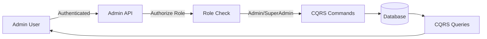
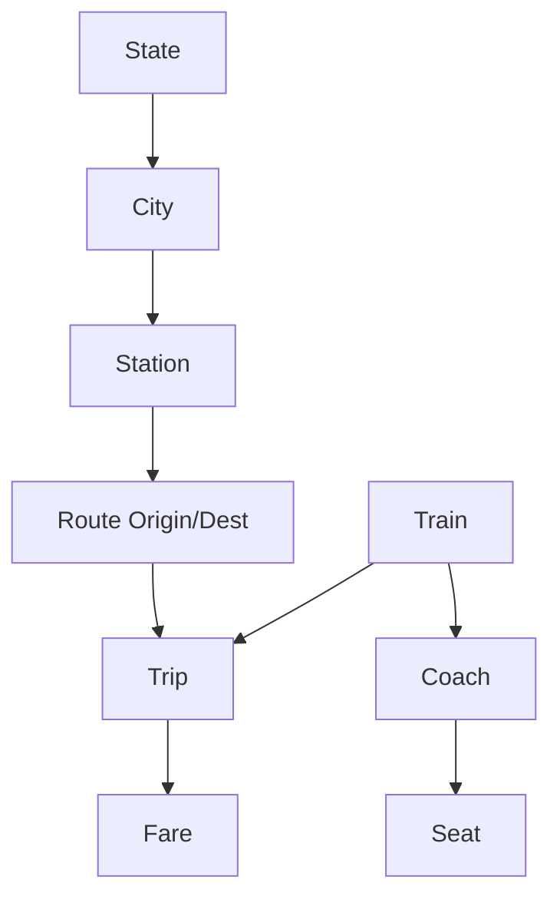

# Admin Data Management Core Features

## Overview

Implement complete CRUD operations for railway infrastructure management with role-based authorization. This allows system administrators to set up and manage the railway network before opening to customers.

## Architecture Flow



## Entity Hierarchy



---

## Phase 1: Role-Based Authorization Setup

### 1.1 Create Admin Roles

**File**: [`Sudan_Train/Program.cs`](/Users/muzafarragab/vs-code-projects/Train-Backend/Sudan_Train/Program.cs)

Add role seeding in startup:

- Create `Admin` and `SuperAdmin` roles
- Create default SuperAdmin user (for initial access)
- Configure authorization policies

**New Files**:

- `Sudan_Train.Infrastructure/Seeding/RoleSeeder.cs`
- `Sudan_Train.Core/Authorization/AdminPolicy.cs`

### 1.2 Authorization Helpers

**New File**: `Sudan_Train.Data/AppMetaData/Roles.cs`

```csharp
public static class Roles
{
    public const string SuperAdmin = "SuperAdmin";
    public const string Admin = "Admin";
    public const string User = "User";
}
```

**Add to Router**: `Sudan_Train.Data/AppMetaData/Router.cs`

```csharp
#region Admin
public const string Admin = Rule + "Admin";
public const string AdminTrains = Admin + "/Trains";
public const string AdminStations = Admin + "/Stations";
// ... etc
#endregion
```

---

## Phase 2: Geography Management (Foundation)

### 2.1 State Management

**Priority**: High (Required for Cities)

**New Files**:

- `Sudan_Train.Core/Features/Admin/States/Commands/CreateState/`
    - `CreateStateCommand.cs`
    - `CreateStateCommandHandler.cs`
    - `CreateStateCommandValidator.cs`
- `Sudan_Train.Core/Features/Admin/States/Commands/UpdateState/`
- `Sudan_Train.Core/Features/Admin/States/Commands/DeleteState/`
- `Sudan_Train.Core/Features/Admin/States/Queries/GetAllStates/`
- `Sudan_Train.Core/Features/Admin/States/Queries/GetStateById/`

**Operations**:

- ✅ Create State (NameEn, NameAr)
- ✅ Update State
- ✅ Delete State (cascade check)
- ✅ Get All States (paginated)
- ✅ Get State by ID (with Cities)

### 2.2 City Management

**Priority**: High (Required for Stations)

**New Files** (similar structure):

- `Sudan_Train.Core/Features/Admin/Cities/Commands/CreateCity/`
- `Sudan_Train.Core/Features/Admin/Cities/Commands/UpdateCity/`
- `Sudan_Train.Core/Features/Admin/Cities/Commands/DeleteCity/`
- `Sudan_Train.Core/Features/Admin/Cities/Queries/GetAllCities/`
- `Sudan_Train.Core/Features/Admin/Cities/Queries/GetCitiesByState/`

**Operations**:

- ✅ Create City (NameEn, NameAr, StateId)
- ✅ Update City
- ✅ Delete City (check for stations)
- ✅ Get All Cities (paginated, with State info)
- ✅ Get Cities by State

---

## Phase 3: Station Management

**Priority**: Critical (Required for Routes)

**New Files**:

- `Sudan_Train.Core/Features/Admin/Stations/Commands/CreateStation/`
    - CreateStationCommand (Code, NameEn, NameAr, CityId, Lat/Long, Address)
- `Sudan_Train.Core/Features/Admin/Stations/Commands/UpdateStation/`
- `Sudan_Train.Core/Features/Admin/Stations/Commands/DeleteStation/`
- `Sudan_Train.Core/Features/Admin/Stations/Queries/GetAllStations/`
- `Sudan_Train.Core/Features/Admin/Stations/Queries/GetStationById/`
- `Sudan_Train.Core/Features/Admin/Stations/Queries/SearchStations/`

**Validations**:

- Station code must be unique (e.g., "KHR" for Khartoum)
- Code: 3-20 characters, alphanumeric
- Lat/Long validation (Sudan boundaries: Lat 8-22, Long 21-39)
- City must exist

**Response DTOs** (new):

- `StationDto` with City and State info included

---

## Phase 4: Train & Coach Management

### 4.1 Train Management

**Priority**: Critical (Required for Trips)

**New Files**:

- `Sudan_Train.Core/Features/Admin/Trains/Commands/CreateTrain/`
    - CreateTrainCommand (TrainNumber, NameEn, NameAr, Type)
- `Sudan_Train.Core/Features/Admin/Trains/Commands/UpdateTrain/`
- `Sudan_Train.Core/Features/Admin/Trains/Commands/DeleteTrain/`
    - Validation: Cannot delete if active trips exist
- `Sudan_Train.Core/Features/Admin/Trains/Queries/GetAllTrains/`
- `Sudan_Train.Core/Features/Admin/Trains/Queries/GetTrainById/`
    - Include coaches and total capacity

**Validations**:

- TrainNumber must be unique (e.g., "TR-001")
- TrainNumber format: alphanumeric, 3-50 chars
- Type: First, Second, or Third class (from CoachClass enum)

### 4.2 Coach Management

**Priority**: High (Required for Seats)

**New Files**:

- `Sudan_Train.Core/Features/Admin/Coaches/Commands/CreateCoach/`
    - CreateCoachCommand (TrainId, CoachNumber, Class, Capacity, Sequence)
- `Sudan_Train.Core/Features/Admin/Coaches/Commands/UpdateCoach/`
- `Sudan_Train.Core/Features/Admin/Coaches/Commands/DeleteCoach/`
- `Sudan_Train.Core/Features/Admin/Coaches/Commands/BulkCreateCoaches/`
    - Helper to create multiple coaches at once (e.g., 10 coaches for a train)
- `Sudan_Train.Core/Features/Admin/Coaches/Queries/GetCoachesByTrain/`

**Validations**:

- CoachNumber unique per train (e.g., "C1", "C2")
- Sequence must be unique per train (ordering)
- Capacity: 20-100 seats

### 4.3 Seat Management

**Priority**: High (Auto-generation preferred)

**New Files**:

- `Sudan_Train.Core/Features/Admin/Seats/Commands/GenerateSeatsForCoach/`
    - Auto-generates seats (1, 2, 3... or 1A, 1B, 2A...)
    - Parameters: CoachId, WindowSeatNumbers[], AccessibleSeatNumbers[]
- `Sudan_Train.Core/Features/Admin/Seats/Commands/UpdateSeat/`
    - Update IsWindow, IsAccessible flags
- `Sudan_Train.Core/Features/Admin/Seats/Queries/GetSeatsByCoach/`

**Auto-Generation Logic**:

```
For capacity 40:
  - Generate seats 1-40
  - Mark even numbers as window seats
  - Mark seat 1 as accessible (wheelchair)
```

---

## Phase 5: Route Management

**Priority**: Critical (Required for Trips)

**New Files**:

- `Sudan_Train.Core/Features/Admin/Routes/Commands/CreateRoute/`
    - CreateRouteCommand (NameEn, NameAr, OriginStationId, DestinationStationId, DistanceKm)
- `Sudan_Train.Core/Features/Admin/Routes/Commands/UpdateRoute/`
- `Sudan_Train.Core/Features/Admin/Routes/Commands/DeleteRoute/`
- `Sudan_Train.Core/Features/Admin/Routes/Commands/AddRouteStation/`
    - Add intermediate stops (RouteStation entity)
    - Parameters: RouteId, StationId, StopOrder, ArrivalMinutesFromStart, DepartureMinutesFromStart
- `Sudan_Train.Core/Features/Admin/Routes/Commands/RemoveRouteStation/`
- `Sudan_Train.Core/Features/Admin/Routes/Queries/GetAllRoutes/`
- `Sudan_Train.Core/Features/Admin/Routes/Queries/GetRouteById/`
    - Include all stations (origin, intermediate, destination)
- `Sudan_Train.Core/Features/Admin/Routes/Queries/SearchRoutes/`
    - By origin/destination

**Validations**:

- Origin != Destination
- Both stations must exist
- DistanceKm > 0
- RouteStation StopOrder must be sequential (1, 2, 3...)
- Arrival time < Departure time at each stop

**Response DTO**:

```csharp
public class RouteDetailDto {
    public int Id { get; set; }
    public string NameEn { get; set; }
    public StationDto Origin { get; set; }
    public StationDto Destination { get; set; }
    public decimal? DistanceKm { get; set; }
    public List<RouteStationDto> IntermediateStops { get; set; }
}
```

---

## Phase 6: Trip Management

**Priority**: Critical (Core business logic)

**New Files**:

- `Sudan_Train.Core/Features/Admin/Trips/Commands/CreateTrip/`
    - CreateTripCommand (TrainId, RouteId, DepartureTime, ArrivalTime, Status)
- `Sudan_Train.Core/Features/Admin/Trips/Commands/UpdateTrip/`
- `Sudan_Train.Core/Features/Admin/Trips/Commands/CancelTrip/`
    - Set Status = "Cancelled"
    - Notify affected passengers (future enhancement)
- `Sudan_Train.Core/Features/Admin/Trips/Commands/InitializeTripSeats/`
    - Create TripSeat records for all seats on the train
    - Status: Available by default
- `Sudan_Train.Core/Features/Admin/Trips/Queries/GetAllTrips/`
    - Filter by: Date range, Route, Train, Status
    - Pagination
- `Sudan_Train.Core/Features/Admin/Trips/Queries/GetTripById/`
    - Include Train, Route, Seat availability count

**Validations**:

- Train and Route must exist
- DepartureTime must be in the future (for new trips)
- ArrivalTime > DepartureTime
- No overlapping trips for same train (train can't be in two places)

**Business Logic**:

- When trip is created, auto-generate TripSeats from Train's coaches/seats
- Status options: "Scheduled", "Delayed", "Departed", "Arrived", "Cancelled"

---

## Phase 7: Fare Management

**Priority**: High (Required for bookings)

**New Files**:

- `Sudan_Train.Core/Features/Admin/Fares/Commands/CreateFare/`
    - CreateFareCommand (TripId?, CoachClass, Price, VatRate, DiscountPercent, EffectiveFrom, EffectiveTo)
- `Sudan_Train.Core/Features/Admin/Fares/Commands/UpdateFare/`
- `Sudan_Train.Core/Features/Admin/Fares/Commands/DeleteFare/`
- `Sudan_Train.Core/Features/Admin/Fares/Queries/GetFaresByTrip/`
- `Sudan_Train.Core/Features/Admin/Fares/Queries/GetActiveFares/`
    - Where EffectiveFrom <= Now < EffectiveTo

**Validations**:

- Price > 0
- VatRate: 0-50% (Sudan VAT ~17%)
- DiscountPercent: 0-100%
- EffectiveFrom < EffectiveTo

**Business Logic**:

- Fares can be trip-specific (TripId != null) or global (TripId = null)
- Trip-specific fares override global fares
- Active fares: where current date is between EffectiveFrom and EffectiveTo

---

## Phase 8: Admin Controller & Routes

**New File**: `Sudan_Train/Controllers/AdminController.cs`

Organize endpoints:

```csharp
[ApiController]
[Route(Router.Admin)]
[Authorize(Roles = "Admin,SuperAdmin")]
public class AdminController : ControllerBase
{
    // States: GET/POST/PUT/DELETE /Admin/States
    // Cities: GET/POST/PUT/DELETE /Admin/Cities
    // Stations: GET/POST/PUT/DELETE /Admin/Stations
    // Trains: GET/POST/PUT/DELETE /Admin/Trains
    // Coaches: GET/POST/PUT/DELETE /Admin/Coaches
    // Routes: GET/POST/PUT/DELETE /Admin/Routes
    // Trips: GET/POST/PUT/DELETE /Admin/Trips
    // Fares: GET/POST/PUT/DELETE /Admin/Fares
}
```

**Update**: [`Sudan_Train.Data/AppMetaData/Router.cs`](/Users/muzafarragab/vs-code-projects/Train-Backend/Sudan_Train.Data/AppMetaData/Router.cs)

Add admin route constants for all entities.

---

## Phase 9: Response DTOs & Localization

**New Folder**: `Sudan_Train.Data/DTOs/Admin/`

Create DTOs for:

- StateDto, CityDto, StationDto
- TrainDto, CoachDto, SeatDto
- RouteDto, RouteDetailDto, RouteStationDto
- TripDto, TripDetailDto
- FareDto

**New Resource Files**:

- `Sudan_Train.Core/Resources/Admin/AdminResources.resx` (English)
- `Sudan_Train.Core/Resources/Admin/AdminResources.ar.resx` (Arabic)

Keys:

```
TrainCreated, TrainUpdated, TrainDeleted, TrainNotFound
StationCreated, StationCodeExists, StationHasRoutes
TripCreated, TripOverlap, TripCancelled
// ... etc for all entities
```

---

## Phase 10: Audit & Validation

### 10.1 Audit Logging

Leverage existing [`Sudan_Train.Service/Abstracts/IAuditService.cs`](/Users/muzafarragab/vs-code-projects/Train-Backend/Sudan_Train.Service/Abstracts/IAuditService.cs)

Log all admin actions:

- Train created/updated/deleted
- Station created/updated/deleted
- Trip created/cancelled
- Fare changes

### 10.2 FluentValidation Rules

For each command, create validators with:

- Required field checks
- Length validations
- Format validations (e.g., Station code format)
- Business rule validations (e.g., no overlapping trips)
- Foreign key existence checks

Example:

```csharp
public class CreateStationCommandValidator : AbstractValidator<CreateStationCommand>
{
    public CreateStationCommandValidator(ApplicationDBContext context)
    {
        RuleFor(x => x.Code)
            .NotEmpty().WithMessage("Station code is required")
            .Length(3, 20).WithMessage("Code must be 3-20 characters")
            .Matches("^[A-Z0-9]+$").WithMessage("Code must be alphanumeric uppercase")
            .MustAsync(async (code, ct) => !await context.Stations.AnyAsync(s => s.Code == code, ct))
            .WithMessage("Station code already exists");
    }
}
```

---

## Technical Implementation Details

### Generic Repository Usage

Leverage existing [`Sudan_Train.Infrastructure/InfrastructureBases/IGenericRepositoryAsync.cs`](/Users/muzafarragab/vs-code-projects/Train-Backend/Sudan_Train.Infrastructure/InfrastructureBases/IGenericRepositoryAsync.cs):

No need to create specific repositories - use generic pattern:

```csharp
private readonly IGenericRepositoryAsync<Train> _trainRepository;
private readonly IGenericRepositoryAsync<Station> _stationRepository;
```

### CQRS Pattern

Follow existing structure in [`Sudan_Train.Core/Features/Authentication`](/Users/muzafarragab/vs-code-projects/Train-Backend/Sudan_Train.Core/Features/Authentication):

Each operation has:

1. Command/Query class (request)
2. Handler class (business logic)
3. Validator class (validation rules)

### Response Pattern

Use existing [`Sudan_Train.Core/Bases/Response.cs`](/Users/muzafarragab/vs-code-projects/Train-Backend/Sudan_Train.Core/Bases/Response.cs):

```csharp
return Success<TrainDto>(_adminLocalizer["TrainCreated"], trainDto);
return BadRequest<string>(_adminLocalizer["TrainNumberExists"]);
return NotFound<string>(_adminLocalizer["TrainNotFound"]);
```

---

## Database Considerations

### Existing Tables

All entities already have tables (from existing migrations):

- States, Cities, Stations
- Trains, Coaches, Seats
- Routes, RouteStations
- Trips, TripSeats
- Fares

**No migrations needed** - just implement the CRUD operations.

### Indexes

Consider adding indexes for performance (new migration):

```csharp
builder.HasIndex(x => x.TrainNumber).IsUnique();
builder.HasIndex(x => x.Code).IsUnique(); // Station
builder.HasIndex(x => new { x.TrainId, x.DepartureTime }); // Trip
```

---

## Testing Strategy

### Manual Testing (Postman)

Create new collection: "Sudan Train - Admin API"

Test flows:

1. **Setup Geography**: Create State → City → Station
2. **Setup Fleet**: Create Train → Add Coaches → Generate Seats
3. **Setup Routes**: Create Route → Add Intermediate Stops
4. **Schedule Trips**: Create Trip → Initialize Seats → Set Fares
5. **Management**: Update Trip status, Cancel trip, Update fares

### Test Data

Create seeder for demo data:

- 3 States (Khartoum, Red Sea, Northern)
- 10 Cities
- 15 Stations
- 5 Trains (with coaches and seats)
- 10 Routes
- 20 Trips (upcoming and past)
- Fare matrix for all coach classes

---

## Success Criteria

✅ **Admin can create complete railway infrastructure**:

- States, Cities, Stations with geographical data
- Trains with multiple coaches and seat layouts
- Routes with intermediate stops
- Scheduled trips with seat availability
- Dynamic fare management

✅ **Authorization**: Only Admin/SuperAdmin can access

✅ **Validation**: All business rules enforced

✅ **Audit Trail**: All admin actions logged

✅ **Localization**: All messages in EN/AR

✅ **API Documentation**: All endpoints in Postman

---

## Estimated Timeline

- **Phase 1 (Roles & Auth)**: 0.5 day
- **Phase 2 (Geography)**: 1 day
- **Phase 3 (Stations)**: 1 day
- **Phase 4 (Trains/Coaches/Seats)**: 2 days
- **Phase 5 (Routes)**: 1.5 days
- **Phase 6 (Trips)**: 2 days
- **Phase 7 (Fares)**: 1 day
- **Phase 8 (Controller)**: 0.5 day
- **Phase 9 (DTOs/Localization)**: 1 day
- **Phase 10 (Audit/Validation)**: 1 day

**Total**: ~12 days (can be parallelized for faster delivery)

---

## Next Steps After Completion

1. **Test thoroughly** with Postman
2. **Seed demo data** for development environment
3. **Build Customer Booking API** (depends on this foundation)
4. **Add dashboard analytics** (trip utilization, revenue reports)
5. **Real-time notifications** (trip delays, cancellations)