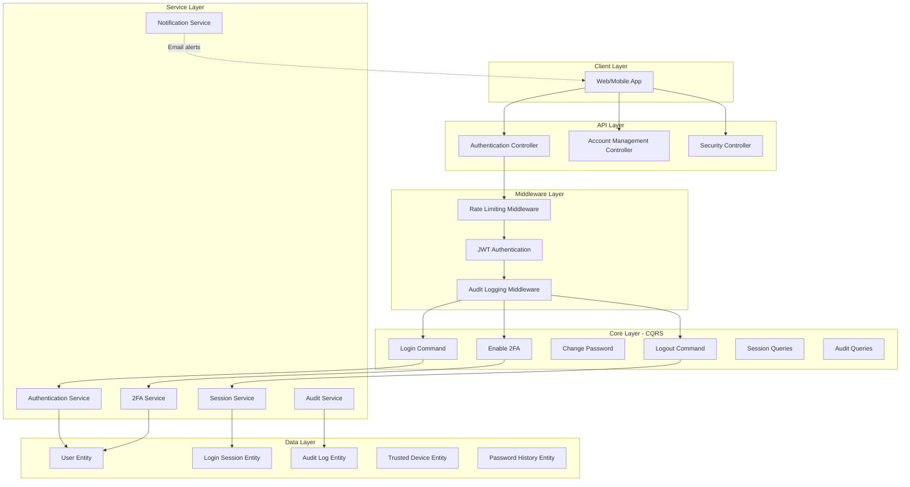

# Complete Authentication System Enhancement

## Overview

This plan implements a production-ready authentication system with 17 major features organized into 8 modules. The implementation follows clean architecture principles using CQRS pattern with MediatR.

## Architecture Diagram



---

## Module 1: Core Security Fixes (Critical)

### 1.1 Fix Account Lockout Enforcement

**Files to Modify:**

- [`Sudan_Train.Core/Features/Authentication/Commands/Login/LoginCommandHandler.cs`](Sudan_Train.Core/Features/Authentication/Commands/Login/LoginCommandHandler.cs)

**Changes:**

```csharp
// Line 48 - Change lockoutOnFailure to true
var signInResult = await _signInManager.CheckPasswordSignInAsync(user, request.Password!, true);

// Add after line 48:
if (signInResult.IsLockedOut)
{
    return Unauthorized<JwtAuthResult>(_authLocalizer[AuthenticationResourcesKeys.AccountLockedOut]);
}
```

### 1.2 Add Email Confirmation Check

**Files to Modify:**

- [`Sudan_Train.Core/Features/Authentication/Commands/Login/LoginCommandHandler.cs`](Sudan_Train.Core/Features/Authentication/Commands/Login/LoginCommandHandler.cs)

**Changes:**

```csharp
// Add after line 45 (after IsActive check):
if (!user.EmailConfirmed)
{
    return Unauthorized<JwtAuthResult>(_authLocalizer[AuthenticationResourcesKeys.EmailNotConfirmed]);
}
```

### 1.3 Implement Logout Endpoint

**New Files to Create:**

1. **Command**: [`Sudan_Train.Core/Features/Authentication/Commands/Logout/LogoutCommand.cs`](Sudan_Train.Core/Features/Authentication/Commands/Logout/LogoutCommand.cs)
```csharp
public class LogoutCommand : IRequest<Response<string>>
{
    public string AccessToken { get; set; }
    public string? RefreshToken { get; set; }
    public bool LogoutAllDevices { get; set; } = false;
}
```

2. **Handler**: [`Sudan_Train.Core/Features/Authentication/Commands/Logout/LogoutCommandHandler.cs`](Sudan_Train.Core/Features/Authentication/Commands/Logout/LogoutCommandHandler.cs)
3. **Validator**: [`Sudan_Train.Core/Features/Authentication/Commands/Logout/LogoutCommandValidator.cs`](Sudan_Train.Core/Features/Authentication/Commands/Logout/LogoutCommandValidator.cs)

**Service Method to Add:**

- Add to [`Sudan_Train.Service/Abstracts/IAuthenticationService.cs`](Sudan_Train.Service/Abstracts/IAuthenticationService.cs):
```csharp
Task<bool> RevokeTokenAsync(string accessToken, string? refreshToken, int userId, bool allDevices);
```


**Controller Endpoint:**

- Add to [`Sudan_Train/Controllers/AuthenticationController.cs`](Sudan_Train/Controllers/AuthenticationController.cs):
```csharp
[Authorize]
[HttpPost(Router.AuthenticationLogout)]
public async Task<IActionResult> Logout([FromBody] LogoutCommand command)
```


### 1.4 Implement Change Password

**New Files to Create:**

1. **Command**: [`Sudan_Train.Core/Features/Authentication/Commands/ChangePassword/ChangePasswordCommand.cs`](Sudan_Train.Core/Features/Authentication/Commands/ChangePassword/ChangePasswordCommand.cs)
```csharp
public class ChangePasswordCommand : IRequest<Response<string>>
{
    public string CurrentPassword { get; set; }
    public string NewPassword { get; set; }
    public string ConfirmPassword { get; set; }
}
```

2. **Handler**: [`Sudan_Train.Core/Features/Authentication/Commands/ChangePassword/ChangePasswordCommandHandler.cs`](Sudan_Train.Core/Features/Authentication/Commands/ChangePassword/ChangePasswordCommandHandler.cs)
3. **Validator**: [`Sudan_Train.Core/Features/Authentication/Commands/ChangePassword/ChangePasswordCommandValidator.cs`](Sudan_Train.Core/Features/Authentication/Commands/ChangePassword/ChangePasswordCommandValidator.cs)

**Controller Endpoint:**

```csharp
[Authorize]
[HttpPost(Router.AuthenticationChangePassword)]
public async Task<IActionResult> ChangePassword([FromBody] ChangePasswordCommand command)
```

---

## Module 2: Two-Factor Authentication (2FA)

### 2.1 Database Entities

**New Entity**: [`Sudan_Train.Data/Entity/Identity/TwoFactorRecoveryCode.cs`](Sudan_Train.Data/Entity/Identity/TwoFactorRecoveryCode.cs)

```csharp
public class TwoFactorRecoveryCode
{
    public int Id { get; set; }
    public int UserId { get; set; }
    public string Code { get; set; }
    public bool IsUsed { get; set; }
    public DateTime CreatedAt { get; set; }
    public DateTime? UsedAt { get; set; }
    
    [ForeignKey(nameof(UserId))]
    public User User { get; set; }
}
```

### 2.2 2FA Service

**New Service**: [`Sudan_Train.Service/Implementations/TwoFactorAuthenticationService.cs`](Sudan_Train.Service/Implementations/TwoFactorAuthenticationService.cs)

```csharp
public interface ITwoFactorAuthenticationService
{
    Task<(string QrCodeUrl, string ManualEntryKey)> EnableTwoFactorAsync(int userId);
    Task<bool> VerifyAndEnableTwoFactorAsync(int userId, string code);
    Task<bool> DisableTwoFactorAsync(int userId, string password);
    Task<List<string>> GenerateRecoveryCodesAsync(int userId);
    Task<bool> ValidateTwoFactorCodeAsync(int userId, string code);
    Task<bool> UseRecoveryCodeAsync(int userId, string code);
}
```

**Dependencies to Add:**

- Install NuGet package: `OtpNet` (for TOTP generation)
- Install NuGet package: `QRCoder` (for QR code generation)

### 2.3 2FA Commands/Queries

**New Commands:**

1. [`Sudan_Train.Core/Features/Authentication/Commands/EnableTwoFactor/EnableTwoFactorCommand.cs`](Sudan_Train.Core/Features/Authentication/Commands/EnableTwoFactor/EnableTwoFactorCommand.cs)
2. [`Sudan_Train.Core/Features/Authentication/Commands/VerifyTwoFactor/VerifyTwoFactorCommand.cs`](Sudan_Train.Core/Features/Authentication/Commands/VerifyTwoFactor/VerifyTwoFactorCommand.cs)
3. [`Sudan_Train.Core/Features/Authentication/Commands/DisableTwoFactor/DisableTwoFactorCommand.cs`](Sudan_Train.Core/Features/Authentication/Commands/DisableTwoFactor/DisableTwoFactorCommand.cs)
4. [`Sudan_Train.Core/Features/Authentication/Commands/GenerateRecoveryCodes/GenerateRecoveryCodesCommand.cs`](Sudan_Train.Core/Features/Authentication/Commands/GenerateRecoveryCodes/GenerateRecoveryCodesCommand.cs)

**Query:**

1. [`Sudan_Train.Core/Features/Authentication/Queries/GetTwoFactorStatus/GetTwoFactorStatusQuery.cs`](Sudan_Train.Core/Features/Authentication/Queries/GetTwoFactorStatus/GetTwoFactorStatusQuery.cs)

### 2.4 Update Login Flow for 2FA

**Modify Login Handler:**

- Update [`Sudan_Train.Core/Features/Authentication/Commands/Login/LoginCommandHandler.cs`](Sudan_Train.Core/Features/Authentication/Commands/Login/LoginCommandHandler.cs)
```csharp
// After password check:
if (user.TwoFactorEnabled && signInResult.RequiresTwoFactor)
{
    // Return special response indicating 2FA required
    return Success(new JwtAuthResult 
    { 
        RequiresTwoFactor = true,
        TempToken = GenerateTempToken(user.Id) // Short-lived token for 2FA step
    });
}
```


**New Command:** [`Sudan_Train.Core/Features/Authentication/Commands/LoginWithTwoFactor/LoginWithTwoFactorCommand.cs`](Sudan_Train.Core/Features/Authentication/Commands/LoginWithTwoFactor/LoginWithTwoFactorCommand.cs)

---

## Module 3: Session & Device Management

### 3.1 Database Entities

**New Entity**: [`Sudan_Train.Data/Entity/Identity/LoginSession.cs`](Sudan_Train.Data/Entity/Identity/LoginSession.cs)

```csharp
public class LoginSession
{
    public int Id { get; set; }
    public int UserId { get; set; }
    public string DeviceId { get; set; }
    public string DeviceName { get; set; }
    public string IpAddress { get; set; }
    public string UserAgent { get; set; }
    public string AccessToken { get; set; }
    public string RefreshToken { get; set; }
    public DateTime LoginTime { get; set; }
    public DateTime LastActivityTime { get; set; }
    public DateTime? LogoutTime { get; set; }
    public bool IsActive { get; set; }
    public string? Location { get; set; } // City, Country
    
    [ForeignKey(nameof(UserId))]
    public User User { get; set; }
}
```

**New Entity**: [`Sudan_Train.Data/Entity/Identity/TrustedDevice.cs`](Sudan_Train.Data/Entity/Identity/TrustedDevice.cs)

```csharp
public class TrustedDevice
{
    public int Id { get; set; }
    public int UserId { get; set; }
    public string DeviceId { get; set; }
    public string DeviceName { get; set; }
    public string DeviceFingerprint { get; set; }
    public DateTime TrustedAt { get; set; }
    public DateTime? LastUsedAt { get; set; }
    public bool IsActive { get; set; }
    
    [ForeignKey(nameof(UserId))]
    public User User { get; set; }
}
```

### 3.2 Session Service

**New Service**: [`Sudan_Train.Service/Implementations/SessionManagementService.cs`](Sudan_Train.Service/Implementations/SessionManagementService.cs)

```csharp
public interface ISessionManagementService
{
    Task<LoginSession> CreateSessionAsync(int userId, string deviceInfo, string ipAddress, string accessToken);
    Task<List<LoginSession>> GetActiveSessionsAsync(int userId);
    Task<bool> TerminateSessionAsync(int sessionId, int userId);
    Task<bool> TerminateAllSessionsExceptCurrentAsync(int userId, int currentSessionId);
    Task UpdateSessionActivityAsync(string accessToken);
}
```

### 3.3 Session Queries/Commands

**New Queries:**

1. [`Sudan_Train.Core/Features/Account/Queries/GetActiveSessions/GetActiveSessionsQuery.cs`](Sudan_Train.Core/Features/Account/Queries/GetActiveSessions/GetActiveSessionsQuery.cs)
2. [`Sudan_Train.Core/Features/Account/Queries/GetTrustedDevices/GetTrustedDevicesQuery.cs`](Sudan_Train.Core/Features/Account/Queries/GetTrustedDevices/GetTrustedDevicesQuery.cs)

**New Commands:**

1. [`Sudan_Train.Core/Features/Account/Commands/TerminateSession/TerminateSessionCommand.cs`](Sudan_Train.Core/Features/Account/Commands/TerminateSession/TerminateSessionCommand.cs)
2. [`Sudan_Train.Core/Features/Account/Commands/LogoutAllDevices/LogoutAllDevicesCommand.cs`](Sudan_Train.Core/Features/Account/Commands/LogoutAllDevices/LogoutAllDevicesCommand.cs)
3. [`Sudan_Train.Core/Features/Account/Commands/RemoveTrustedDevice/RemoveTrustedDeviceCommand.cs`](Sudan_Train.Core/Features/Account/Commands/RemoveTrustedDevice/RemoveTrustedDeviceCommand.cs)

---

## Module 4: Audit Logging & Security Tracking

### 4.1 Database Entities

**New Entity**: [`Sudan_Train.Data/Entity/Identity/AuditLog.cs`](Sudan_Train.Data/Entity/Identity/AuditLog.cs)

```csharp
public class AuditLog
{
    public long Id { get; set; }
    public int? UserId { get; set; }
    public string Action { get; set; } // LOGIN, LOGOUT, PASSWORD_CHANGE, etc.
    public string? EntityType { get; set; }
    public string? EntityId { get; set; }
    public string IpAddress { get; set; }
    public string? UserAgent { get; set; }
    public string? Details { get; set; } // JSON
    public bool Success { get; set; }
    public string? FailureReason { get; set; }
    public DateTime Timestamp { get; set; }
    
    [ForeignKey(nameof(UserId))]
    public User? User { get; set; }
}
```

**New Entity**: [`Sudan_Train.Data/Entity/Identity/SecurityEvent.cs`](Sudan_Train.Data/Entity/Identity/SecurityEvent.cs)

```csharp
public class SecurityEvent
{
    public long Id { get; set; }
    public int UserId { get; set; }
    public SecurityEventType EventType { get; set; }
    public string IpAddress { get; set; }
    public string Details { get; set; }
    public DateTime OccurredAt { get; set; }
    public bool WasNotified { get; set; }
    
    [ForeignKey(nameof(UserId))]
    public User User { get; set; }
}

public enum SecurityEventType
{
    LoginFromNewDevice,
    LoginFromNewLocation,
    PasswordChanged,
    EmailChanged,
    TwoFactorEnabled,
    TwoFactorDisabled,
    FailedLoginAttempt,
    AccountLocked,
    SuspiciousActivity
}
```

### 4.2 Audit Service & Middleware

**New Service**: [`Sudan_Train.Service/Implementations/AuditService.cs`](Sudan_Train.Service/Implementations/AuditService.cs)

```csharp
public interface IAuditService
{
    Task LogAsync(string action, int? userId, string ipAddress, bool success, string? details = null);
    Task<List<AuditLog>> GetUserAuditLogsAsync(int userId, int pageNumber, int pageSize);
    Task LogSecurityEventAsync(int userId, SecurityEventType eventType, string ipAddress, string details);
}
```

**New Middleware**: [`Sudan_Train.Core/Middleware/AuditLoggingMiddleware.cs`](Sudan_Train.Core/Middleware/AuditLoggingMiddleware.cs)

- Automatically logs all authentication-related requests

### 4.3 Audit Queries

**New Queries:**

1. [`Sudan_Train.Core/Features/Account/Queries/GetLoginHistory/GetLoginHistoryQuery.cs`](Sudan_Train.Core/Features/Account/Queries/GetLoginHistory/GetLoginHistoryQuery.cs)
2. [`Sudan_Train.Core/Features/Account/Queries/GetSecurityEvents/GetSecurityEventsQuery.cs`](Sudan_Train.Core/Features/Account/Queries/GetSecurityEvents/GetSecurityEventsQuery.cs)
3. [`Sudan_Train.Core/Features/Account/Queries/GetAuditLogs/GetAuditLogsQuery.cs`](Sudan_Train.Core/Features/Account/Queries/GetAuditLogs/GetAuditLogsQuery.cs)

---

## Module 5: Rate Limiting & Brute Force Protection

### 5.1 Rate Limiting Service

**New Service**: [`Sudan_Train.Service/Implementations/RateLimitingService.cs`](Sudan_Train.Service/Implementations/RateLimitingService.cs)

```csharp
public interface IRateLimitingService
{
    Task<bool> IsAllowedAsync(string key, int maxAttempts, TimeSpan window);
    Task IncrementAsync(string key);
    Task ResetAsync(string key);
}
```

**Use Distributed Cache (Redis or Memory):**

- Install NuGet: `Microsoft.Extensions.Caching.StackExchangeRedis` (for Redis)
- Or use `IMemoryCache` for in-memory caching

### 5.2 Rate Limiting Middleware

**New Middleware**: [`Sudan_Train.Core/Middleware/RateLimitingMiddleware.cs`](Sudan_Train.Core/Middleware/RateLimitingMiddleware.cs)

```csharp
public class RateLimitingMiddleware
{
    // Apply rate limits to:
    // - /Login: 5 attempts per 15 minutes per IP
    // - /Register: 3 attempts per hour per IP
    // - /SendResetPasswordCode: 3 attempts per hour per email
    // - /RefreshToken: 10 attempts per minute per user
}
```

### 5.3 Configuration

**Update**: [`Sudan_Train/appsettings.json`](Sudan_Train/appsettings.json)

```json
"RateLimiting": {
  "Login": {
    "MaxAttempts": 5,
    "WindowMinutes": 15
  },
  "Register": {
    "MaxAttempts": 3,
    "WindowMinutes": 60
  },
  "PasswordReset": {
    "MaxAttempts": 3,
    "WindowMinutes": 60
  }
}
```

---

## Module 6: Account Management & Profile

### 6.1 Profile Management Commands

**New Commands:**

1. [`Sudan_Train.Core/Features/Account/Commands/UpdateProfile/UpdateProfileCommand.cs`](Sudan_Train.Core/Features/Account/Commands/UpdateProfile/UpdateProfileCommand.cs)
```csharp
public class UpdateProfileCommand : IRequest<Response<string>>
{
    public string FirstName { get; set; }
    public string LastName { get; set; }
    public string? Address { get; set; }
    public string? Nationality { get; set; }
}
```

2. [`Sudan_Train.Core/Features/Account/Commands/ChangeEmail/ChangeEmailCommand.cs`](Sudan_Train.Core/Features/Account/Commands/ChangeEmail/ChangeEmailCommand.cs)
3. [`Sudan_Train.Core/Features/Account/Commands/ChangeUsername/ChangeUsernameCommand.cs`](Sudan_Train.Core/Features/Account/Commands/ChangeUsername/ChangeUsernameCommand.cs)
4. [`Sudan_Train.Core/Features/Account/Commands/DeleteAccount/DeleteAccountCommand.cs`](Sudan_Train.Core/Features/Account/Commands/DeleteAccount/DeleteAccountCommand.cs)
5. [`Sudan_Train.Core/Features/Account/Commands/ExportUserData/ExportUserDataCommand.cs`](Sudan_Train.Core/Features/Account/Commands/ExportUserData/ExportUserDataCommand.cs)

### 6.2 Profile Queries

**New Queries:**

1. [`Sudan_Train.Core/Features/Account/Queries/GetProfile/GetProfileQuery.cs`](Sudan_Train.Core/Features/Account/Queries/GetProfile/GetProfileQuery.cs)
2. [`Sudan_Train.Core/Features/Account/Queries/GetAccountSettings/GetAccountSettingsQuery.cs`](Sudan_Train.Core/Features/Account/Queries/GetAccountSettings/GetAccountSettingsQuery.cs)

### 6.3 New Controller

**New Controller**: [`Sudan_Train/Controllers/AccountController.cs`](Sudan_Train/Controllers/AccountController.cs)

```csharp
[Authorize]
[ApiController]
public class AccountController : AppControllerBase
{
    // All account management endpoints
}
```

**Update Router**: [`Sudan_Train.Data/AppMetaData/Router.cs`](Sudan_Train.Data/AppMetaData/Router.cs)

```csharp
public const string Account = Rule + "Account";
public const string AccountProfile = Account + "/Profile";
public const string AccountSessions = Account + "/Sessions";
public const string AccountSecurity = Account + "/Security";
// ... more routes
```

---

## Module 7: Password Security Enhancements

### 7.1 Password History

**New Entity**: [`Sudan_Train.Data/Entity/Identity/PasswordHistory.cs`](Sudan_Train.Data/Entity/Identity/PasswordHistory.cs)

```csharp
public class PasswordHistory
{
    public int Id { get; set; }
    public int UserId { get; set; }
    public string PasswordHash { get; set; }
    public DateTime ChangedAt { get; set; }
    
    [ForeignKey(nameof(UserId))]
    public User User { get; set; }
}
```

### 7.2 Password Validation Service

**New Service**: [`Sudan_Train.Service/Implementations/PasswordSecurityService.cs`](Sudan_Train.Service/Implementations/PasswordSecurityService.cs)

```csharp
public interface IPasswordSecurityService
{
    Task<bool> IsPasswordInHistoryAsync(int userId, string newPassword, int historyCount = 5);
    Task AddToPasswordHistoryAsync(int userId, string passwordHash);
    Task<PasswordStrength> CheckPasswordStrengthAsync(string password);
    Task<bool> IsCommonPasswordAsync(string password);
}

public class PasswordStrength
{
    public int Score { get; set; } // 0-4
    public List<string> Feedback { get; set; }
    public bool IsStrong => Score >= 3;
}
```

### 7.3 Update User Entity

**Modify**: [`Sudan_Train.Data/Entity/Identity/User.cs`](Sudan_Train.Data/Entity/Identity/User.cs)

```csharp
public DateTime? PasswordChangedAt { get; set; }
public bool MustChangePassword { get; set; } = false;
public int PasswordExpiryDays { get; set; } = 90; // 0 = never expires

public ICollection<PasswordHistory> PasswordHistories { get; set; }
```

### 7.4 Password Policy Configuration

**Update**: [`Sudan_Train/appsettings.json`](Sudan_Train/appsettings.json)

```json
"PasswordPolicy": {
  "MinimumLength": 8,
  "RequireUppercase": true,
  "RequireLowercase": true,
  "RequireDigit": true,
  "RequireSpecialCharacter": true,
  "PreventPasswordReuse": 5,
  "PasswordExpiryDays": 90,
  "CheckCommonPasswords": true
}
```

---

## Module 8: Security Notifications

### 8.1 Notification Service Enhancement

**Update**: [`Sudan_Train.Service/Abstracts/IEmailService.cs`](Sudan_Train.Service/Abstracts/IEmailService.cs)

Add notification methods:

```csharp
Task SendLoginNotificationAsync(string email, string deviceName, string location, string ipAddress);
Task SendPasswordChangedNotificationAsync(string email);
Task SendEmailChangedNotificationAsync(string oldEmail, string newEmail);
Task SendNewDeviceLoginNotificationAsync(string email, string deviceName, string location);
Task SendAccountLockedNotificationAsync(string email, DateTime unlockTime);
Task SendTwoFactorEnabledNotificationAsync(string email);
```

### 8.2 Update Handlers to Send Notifications

Modify handlers to send notifications:

- Login from new device
- Password change
- Email change
- 2FA enable/disable
- Account locked
- Suspicious activity detected

---

## Module 9: OAuth / Social Login Integration

### 9.1 Install Packages

```bash
dotnet add package Microsoft.AspNetCore.Authentication.Google
dotnet add package Microsoft.AspNetCore.Authentication.Facebook
dotnet add package Microsoft.AspNetCore.Authentication.MicrosoftAccount
```

### 9.2 Update User Entity

**Modify**: [`Sudan_Train.Data/Entity/Identity/User.cs`](Sudan_Train.Data/Entity/Identity/User.cs)

```csharp
public string? GoogleId { get; set; }
public string? FacebookId { get; set; }
public string? MicrosoftId { get; set; }
public string? AppleId { get; set; }
public string? ProfilePictureUrl { get; set; }
```

### 9.3 OAuth Configuration

**Update**: [`Sudan_Train.Infrastructure/ServiceRegisteration.cs`](Sudan_Train.Infrastructure/ServiceRegisteration.cs)

```csharp
services.AddAuthentication()
    .AddGoogle(options => {
        options.ClientId = configuration["Authentication:Google:ClientId"];
        options.ClientSecret = configuration["Authentication:Google:ClientSecret"];
    })
    .AddFacebook(options => {
        options.AppId = configuration["Authentication:Facebook:AppId"];
        options.AppSecret = configuration["Authentication:Facebook:AppSecret"];
    });
```

### 9.4 OAuth Commands

**New Commands:**

1. [`Sudan_Train.Core/Features/Authentication/Commands/LoginWithGoogle/LoginWithGoogleCommand.cs`](Sudan_Train.Core/Features/Authentication/Commands/LoginWithGoogle/LoginWithGoogleCommand.cs)
2. [`Sudan_Train.Core/Features/Authentication/Commands/LinkGoogleAccount/LinkGoogleAccountCommand.cs`](Sudan_Train.Core/Features/Authentication/Commands/LinkGoogleAccount/LinkGoogleAccountCommand.cs)
3. Similar commands for Facebook, Microsoft, Apple

---

## Module 10: Database Migrations & Configuration

### 10.1 Create Migration

```bash
dotnet ef migrations add EnhancedAuthenticationSystem \
  --project Sudan_Train.Infrastructure \
  --startup-project Sudan_Train \
  --context ApplicationDBContext
```

### 10.2 Entity Configurations

**New Configurations:**

1. [`Sudan_Train.Infrastructure/Configurations/LoginSessionConfiguration.cs`](Sudan_Train.Infrastructure/Configurations/LoginSessionConfiguration.cs)
2. [`Sudan_Train.Infrastructure/Configurations/AuditLogConfiguration.cs`](Sudan_Train.Infrastructure/Configurations/AuditLogConfiguration.cs)
3. [`Sudan_Train.Infrastructure/Configurations/SecurityEventConfiguration.cs`](Sudan_Train.Infrastructure/Configurations/SecurityEventConfiguration.cs)
4. [`Sudan_Train.Infrastructure/Configurations/TrustedDeviceConfiguration.cs`](Sudan_Train.Infrastructure/Configurations/TrustedDeviceConfiguration.cs)
5. [`Sudan_Train.Infrastructure/Configurations/PasswordHistoryConfiguration.cs`](Sudan_Train.Infrastructure/Configurations/PasswordHistoryConfiguration.cs)
6. [`Sudan_Train.Infrastructure/Configurations/TwoFactorRecoveryCodeConfiguration.cs`](Sudan_Train.Infrastructure/Configurations/TwoFactorRecoveryCodeConfiguration.cs)

### 10.3 Update DbContext

**Modify**: [`Sudan_Train.Infrastructure/context/ApplicationDBContext.cs`](Sudan_Train.Infrastructure/context/ApplicationDBContext.cs)

```csharp
public DbSet<LoginSession> LoginSessions { get; set; }
public DbSet<AuditLog> AuditLogs { get; set; }
public DbSet<SecurityEvent> SecurityEvents { get; set; }
public DbSet<TrustedDevice> TrustedDevices { get; set; }
public DbSet<PasswordHistory> PasswordHistories { get; set; }
public DbSet<TwoFactorRecoveryCode> TwoFactorRecoveryCodes { get; set; }
```

### 10.4 Add Indexes

```csharp
// In configurations:
builder.HasIndex(x => x.UserId);
builder.HasIndex(x => x.IpAddress);
builder.HasIndex(x => new { x.UserId, x.IsActive });
builder.HasIndex(x => x.Timestamp);
```

---

## Module 11: Dependency Injection Registration

### 11.1 Update Service Registration

**Modify**: [`Sudan_Train.Service/ModuleServiceDependencies.cs`](Sudan_Train.Service/ModuleServiceDependencies.cs)

```csharp
// Add new services
services.AddTransient<ITwoFactorAuthenticationService, TwoFactorAuthenticationService>();
services.AddTransient<ISessionManagementService, SessionManagementService>();
services.AddTransient<IAuditService, AuditService>();
services.AddTransient<IRateLimitingService, RateLimitingService>();
services.AddTransient<IPasswordSecurityService, PasswordSecurityService>();

// Add caching
services.AddMemoryCache();
// Or for Redis:
services.AddStackExchangeRedisCache(options => {
    options.Configuration = configuration["Redis:ConnectionString"];
});
```

### 11.2 Update Infrastructure Registration

**Modify**: [`Sudan_Train.Infrastructure/ModuleInfrastructureDependencies.cs`](Sudan_Train.Infrastructure/ModuleInfrastructureDependencies.cs)

```csharp
// Add new repositories
services.AddTransient<IGenericRepositoryAsync<LoginSession>, GenericRepositoryAsync<LoginSession>>();
services.AddTransient<IGenericRepositoryAsync<AuditLog>, GenericRepositoryAsync<AuditLog>>();
services.AddTransient<IGenericRepositoryAsync<SecurityEvent>, GenericRepositoryAsync<SecurityEvent>>();
// ... more repositories
```

---

## Module 12: Middleware Pipeline Configuration

### 12.1 Update Program.cs

**Modify**: [`Sudan_Train/Program.cs`](Sudan_Train/Program.cs)

```csharp
// Add middleware in correct order (after UseRouting):
app.UseMiddleware<RateLimitingMiddleware>();
app.UseAuthentication();
app.UseAuthorization();
app.UseMiddleware<AuditLoggingMiddleware>();
```

---

## Module 13: Localization Resources

### 13.1 Update Resources

**Modify**: [`Sudan_Train.Core/Resources/Authentication/AuthenticationResourcesKeys.cs`](Sudan_Train.Core/Resources/Authentication/AuthenticationResourcesKeys.cs)

Add new keys:

```csharp
public const string AccountLockedOut = "AccountLockedOut";
public const string EmailNotConfirmed = "EmailNotConfirmed";
public const string TwoFactorCodeRequired = "TwoFactorCodeRequired";
public const string InvalidTwoFactorCode = "InvalidTwoFactorCode";
public const string SessionTerminated = "SessionTerminated";
public const string PasswordInHistory = "PasswordInHistory";
public const string WeakPassword = "WeakPassword";
// ... 30+ more keys
```

**Update**: [`Sudan_Train.Core/Resources/Authentication/AuthenticationResources.resx`](Sudan_Train.Core/Resources/Authentication/AuthenticationResources.resx)

- Add English translations for all new keys

**Update**: [`Sudan_Train.Core/Resources/Authentication/AuthenticationResources.ar.resx`](Sudan_Train.Core/Resources/Authentication/AuthenticationResources.ar.resx)

- Add Arabic translations for all new keys

---

## Module 14: Security Enhancements

### 14.1 Update JWT Settings

**Modify**: [`Sudan_Train.Infrastructure/ServiceRegisteration.cs`](Sudan_Train.Infrastructure/ServiceRegisteration.cs)

```csharp
x.RequireHttpsMetadata = true; // Change from false
x.TokenValidationParameters = new TokenValidationParameters
{
    ValidateIssuer = true,
    ValidateAudience = true,
    ValidateLifetime = true,
    ValidateIssuerSigningKey = true,
    ClockSkew = TimeSpan.Zero, // Remove 5-minute default tolerance
};
```

### 14.2 Update CORS Policy

**Modify**: [`Sudan_Train/Program.cs`](Sudan_Train/Program.cs)

```csharp
builder.Services.AddCors(options =>
{
    options.AddPolicy(name: CORS,
        policy =>
        {
            policy.WithOrigins(
                builder.Configuration.GetSection("Cors:AllowedOrigins").Get<string[]>()
            )
            .AllowedMethods("GET", "POST", "PUT", "DELETE")
            .AllowedHeaders("*")
            .AllowCredentials();
        });
});
```

### 14.3 Add Security Headers

**New Middleware**: [`Sudan_Train.Core/Middleware/SecurityHeadersMiddleware.cs`](Sudan_Train.Core/Middleware/SecurityHeadersMiddleware.cs)

```csharp
// Add headers:
// X-Content-Type-Options: nosniff
// X-Frame-Options: DENY
// X-XSS-Protection: 1; mode=block
// Strict-Transport-Security: max-age=31536000
```

---

## Module 15: Testing & Validation

### 15.1 Unit Tests

Create test files for each new command/query handler:

- [`Tests/Authentication/LogoutCommandHandlerTests.cs`](Tests/Authentication/LogoutCommandHandlerTests.cs)
- [`Tests/Authentication/Enable2FACommandHandlerTests.cs`](Tests/Authentication/Enable2FACommandHandlerTests.cs)
- [`Tests/Security/RateLimitingMiddlewareTests.cs`](Tests/Security/RateLimitingMiddlewareTests.cs)
- etc.

### 15.2 Integration Tests

- Test full authentication flows
- Test rate limiting behavior
- Test 2FA enrollment and verification
- Test session management

---

## Module 16: Documentation

### 16.1 API Documentation

**New File**: [`docs/api/authentication-api.md`](docs/api/authentication-api.md)

- Document all new endpoints
- Include request/response examples
- Add Swagger/OpenAPI annotations

### 16.2 Security Documentation

**New File**: [`docs/security/authentication-security.md`](docs/security/authentication-security.md)

- Document security features
- Explain rate limiting policies
- 2FA setup guide
- Session management guide

### 16.3 User Guides

**New Files:**

- [`docs/guides/enable-2fa.md`](docs/guides/enable-2fa.md)
- [`docs/guides/manage-sessions.md`](docs/guides/manage-sessions.md)
- [`docs/guides/account-security.md`](docs/guides/account-security.md)

---

## Implementation Summary

### Files to Create: ~120 files

- 30+ Command files (Command, Handler, Validator)
- 15+ Query files
- 6 new entities
- 6 entity configurations
- 8 new services (Interface + Implementation)
- 3 middleware classes
- 2 new controllers
- 20+ test files
- 10+ documentation files
- Email templates
- Localization resources

### Files to Modify: ~15 files

- LoginCommandHandler.cs
- User.cs
- ApplicationDBContext.cs
- ServiceRegisteration.cs
- Program.cs
- appsettings.json
- Router.cs
- AuthenticationService.cs
- IAuthenticationService.cs
- ModuleServiceDependencies.cs
- ModuleInfrastructureDependencies.cs
- Resource files

### Database Changes

- 6 new tables
- Multiple new indexes
- Foreign key relationships
- 1 major migration

### NuGet Packages to Install

- OtpNet (2FA TOTP)
- QRCoder (QR code generation)
- Microsoft.Extensions.Caching.StackExchangeRedis (optional, for Redis)
- Microsoft.AspNetCore.Authentication.Google
- Microsoft.AspNetCore.Authentication.Facebook
- Microsoft.AspNetCore.Authentication.MicrosoftAccount

---

## Testing Checklist

After implementation:

- [ ] Login works with lockout enforcement
- [ ] Email confirmation required
- [ ] Logout revokes tokens
- [ ] Change password works
- [ ] 2FA enrollment works
- [ ] 2FA login works
- [ ] Recovery codes work
- [ ] Sessions tracked correctly
- [ ] Logout all devices works
- [ ] Rate limiting blocks excessive attempts
- [ ] Audit logs recorded
- [ ] Security events logged
- [ ] Email notifications sent
- [ ] Profile updates work
- [ ] OAuth login works (Google, Facebook)
- [ ] Password history enforced
- [ ] Trusted devices tracked
- [ ] All validations work
- [ ] Localization works (EN/AR)
- [ ] Swagger documentation updated

---

## Deployment Notes

1. **Database Migration**: Run migration before deploying
2. **Redis Setup**: Configure Redis connection if using distributed caching
3. **OAuth Credentials**: Set up OAuth apps in Google/Facebook developer consoles
4. **SMTP Configuration**: Ensure email service works for notifications
5. **HTTPS**: Enable HTTPS in production (RequireHttpsMetadata = true)
6. **Environment Variables**: Set all sensitive configurations via environment variables
7. **Rate Limiting**: Adjust limits based on expected traffic
8. **Session Cleanup**: Implement background job to clean expired sessions/tokens

---

## Estimated Development Time

- Module 1 (Core Fixes): 1 day
- Module 2 (2FA): 2-3 days
- Module 3 (Sessions): 2 days
- Module 4 (Audit Logging): 2 days
- Module 5 (Rate Limiting): 1 day
- Module 6 (Account Management): 2 days
- Module 7 (Password Security): 1 day
- Module 8 (Notifications): 1 day
- Module 9 (OAuth): 2-3 days
- Testing & Documentation: 2-3 days

**Total: 16-20 days** (with 1 developer)