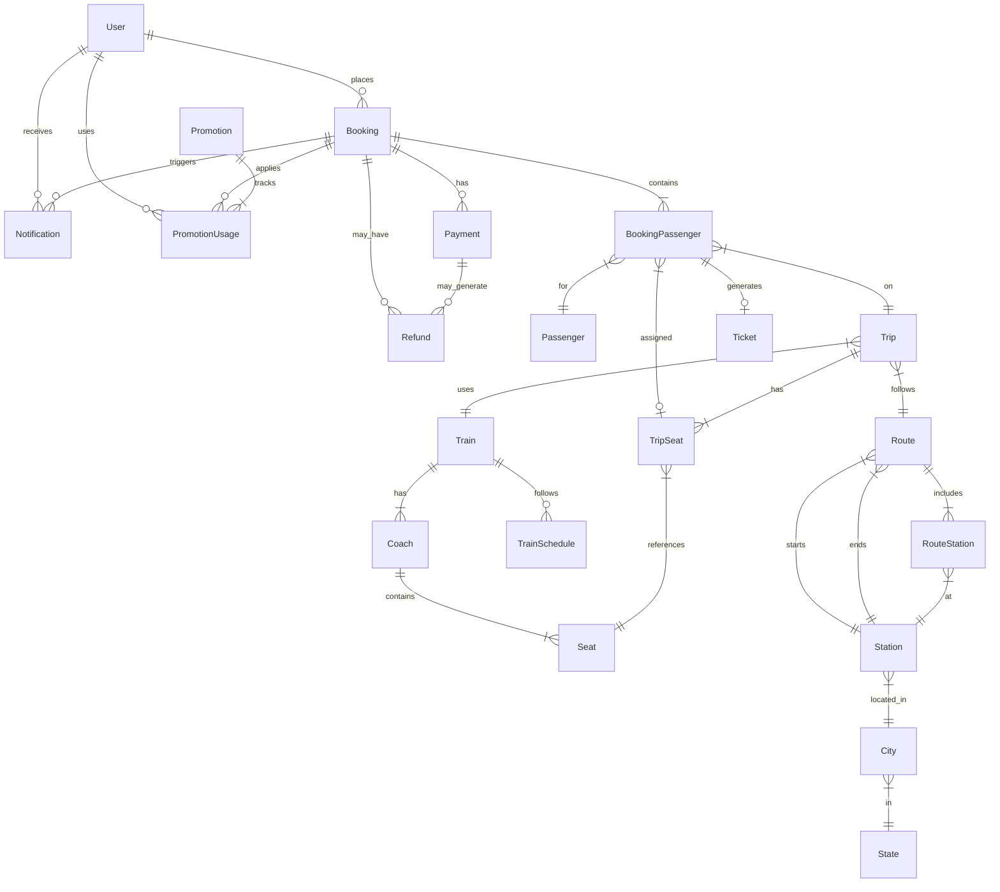

# Database Architecture Implementation Plan

## Overview

This plan implements all Priority 1, 2, and 3 improvements from the database architecture review, including breaking changes and new entities.

## Phase 1: Create Base Classes and Interfaces

### 1.1 Create Base Entity Classes

Create [`Sudan_Train.Data/Commons/AuditableEntity.cs`](Sudan_Train.Data/Commons/AuditableEntity.cs):

```csharp
public abstract class AuditableEntity
{
    public DateTime CreatedAt { get; set; } = DateTime.UtcNow;
    public DateTime? UpdatedAt { get; set; }
    public int? CreatedBy { get; set; }
    public int? UpdatedBy { get; set; }
}
```

Create [`Sudan_Train.Data/Commons/SoftDeletableEntity.cs`](Sudan_Train.Data/Commons/SoftDeletableEntity.cs):

```csharp
public abstract class SoftDeletableEntity : AuditableEntity
{
    public bool IsDeleted { get; set; } = false;
    public DateTime? DeletedAt { get; set; }
    public int? DeletedBy { get; set; }
}
```

## Phase 2: Update Existing Entities

### 2.1 Add Audit Fields to Core Entities

Update these entities to inherit from `AuditableEntity`:

- [`Sudan_Train.Data/Entity/Train.cs`](Sudan_Train.Data/Entity/Train.cs) - Add inheritance
- [`Sudan_Train.Data/Entity/Coach.cs`](Sudan_Train.Data/Entity/Coach.cs) - Add inheritance
- [`Sudan_Train.Data/Entity/Trip.cs`](Sudan_Train.Data/Entity/Trip.cs) - Add inheritance
- [`Sudan_Train.Data/Entity/Passenger.cs`](Sudan_Train.Data/Entity/Passenger.cs) - Add inheritance
- [`Sudan_Train.Data/Entity/Route.cs`](Sudan_Train.Data/Entity/Route.cs) - Add inheritance

### 2.2 Remove Redundant Fields (Breaking Changes)

**In [`Sudan_Train.Data/Entity/BookingPassenger.cs`](Sudan_Train.Data/Entity/BookingPassenger.cs):**

- Remove `SeatNumber` property (line 37) - derive from `TripSeat.Seat.SeatNumber`
- Add computed property: `public string SeatNumber => TripSeat?.Seat?.SeatNumber ?? "N/A";`

**In [`Sudan_Train.Data/Entity/TripSeat.cs`](Sudan_Train.Data/Entity/TripSeat.cs):**

- Remove `CoachId` foreign key (lines 21-24)
- Remove `Coach` navigation property
- Add computed property: `public Coach Coach => Seat.Coach;`

### 2.3 Add Missing Required Attributes

**In [`Sudan_Train.Data/Entity/Train.cs`](Sudan_Train.Data/Entity/Train.cs):**

- Add `[Required]` to `NameEn` (line 14)

**In [`Sudan_Train.Data/Entity/Passenger.cs`](Sudan_Train.Data/Entity/Passenger.cs):**

- Add `[Required]` to `IdNumber` (line 25)
- Add encryption: `[EncryptColumn]` to `IdNumber`

### 2.4 Add Security Enhancements

**In [`Sudan_Train.Data/Entity/Payment.cs`](Sudan_Train.Data/Entity/Payment.cs):**

- Add `[EncryptColumn]` to `CardToken` (line 28)
- Add `[EncryptColumn]` to `ProcessorResponse` (line 24)

### 2.5 Add Missing Fields

**In [`Sudan_Train.Data/Entity/Booking.cs`](Sudan_Train.Data/Entity/Booking.cs):**

Add cancellation tracking fields:

```csharp
public DateTime? CancelledAt { get; set; }
public string? CancellationReason { get; set; }
public int? CancelledBy { get; set; }
public decimal? RefundAmount { get; set; }
```

## Phase 3: Create New Entities

### 3.1 Refund Entity

Create [`Sudan_Train.Data/Entity/Refund.cs`](Sudan_Train.Data/Entity/Refund.cs):

```csharp
public class Refund : AuditableEntity
{
    [Key]
    public int Id { get; set; }
    
    public int PaymentId { get; set; }
    [ForeignKey(nameof(PaymentId))]
    public Payment Payment { get; set; }
    
    public int BookingId { get; set; }
    [ForeignKey(nameof(BookingId))]
    public Booking Booking { get; set; }
    
    [Required, MaxLength(50)]
    public string RefundNumber { get; set; }
    
    public decimal Amount { get; set; }
    public string Currency { get; set; } = "SDG";
    
    public RefundStatus Status { get; set; }
    public RefundMethod Method { get; set; }
    
    [MaxLength(500)]
    public string? Reason { get; set; }
    
    public string? ProcessorResponse { get; set; }
    public DateTime? ProcessedAt { get; set; }
}
```

### 3.2 Notification Entity

Create [`Sudan_Train.Data/Entity/Notification.cs`](Sudan_Train.Data/Entity/Notification.cs):

```csharp
public class Notification : AuditableEntity
{
    [Key]
    public int Id { get; set; }
    
    public int? UserId { get; set; }
    [ForeignKey(nameof(UserId))]
    public User? User { get; set; }
    
    public int? BookingId { get; set; }
    [ForeignKey(nameof(BookingId))]
    public Booking? Booking { get; set; }
    
    public NotificationType Type { get; set; }
    
    [Required, MaxLength(200)]
    public string Subject { get; set; }
    
    [Required]
    public string Message { get; set; }
    
    public bool IsRead { get; set; } = false;
    public DateTime? ReadAt { get; set; }
    
    public NotificationChannel Channel { get; set; }
    public bool IsSent { get; set; } = false;
    public DateTime? SentAt { get; set; }
}
```

### 3.3 TrainSchedule Entity

Create [`Sudan_Train.Data/Entity/TrainSchedule.cs`](Sudan_Train.Data/Entity/TrainSchedule.cs):

```csharp
public class TrainSchedule : AuditableEntity
{
    [Key]
    public int Id { get; set; }
    
    [Required, MaxLength(100)]
    public string Name { get; set; }
    
    public int TrainId { get; set; }
    [ForeignKey(nameof(TrainId))]
    public Train Train { get; set; }
    
    public int RouteId { get; set; }
    [ForeignKey(nameof(RouteId))]
    public Route Route { get; set; }
    
    public RecurrenceType RecurrenceType { get; set; }
    public TimeSpan DepartureTime { get; set; }
    public TimeSpan ArrivalTime { get; set; }
    
    public string? DaysOfWeek { get; set; } // JSON: [1,3,5] for Mon,Wed,Fri
    
    public DateTime EffectiveFrom { get; set; }
    public DateTime? EffectiveTo { get; set; }
    
    public bool IsActive { get; set; } = true;
}
```

### 3.4 Promotion Entity

Create [`Sudan_Train.Data/Entity/Promotion.cs`](Sudan_Train.Data/Entity/Promotion.cs):

```csharp
public class Promotion : AuditableEntity
{
    [Key]
    public int Id { get; set; }
    
    [Required, MaxLength(100)]
    public string Code { get; set; }
    
    [Required, MaxLength(200)]
    public string NameEn { get; set; }
    
    [MaxLength(200)]
    public string? NameAr { get; set; }
    
    public string? DescriptionEn { get; set; }
    public string? DescriptionAr { get; set; }
    
    public PromotionType Type { get; set; }
    public decimal DiscountValue { get; set; }
    public decimal? MaxDiscount { get; set; }
    public decimal? MinimumPurchase { get; set; }
    
    public int? MaxUsageCount { get; set; }
    public int UsageCount { get; set; } = 0;
    
    public DateTime ValidFrom { get; set; }
    public DateTime ValidTo { get; set; }
    
    public bool IsActive { get; set; } = true;
    
    public ICollection<PromotionUsage> PromotionUsages { get; set; }
}
```

### 3.5 PromotionUsage Entity

Create [`Sudan_Train.Data/Entity/PromotionUsage.cs`](Sudan_Train.Data/Entity/PromotionUsage.cs):

```csharp
public class PromotionUsage : AuditableEntity
{
    [Key]
    public int Id { get; set; }
    
    public int PromotionId { get; set; }
    [ForeignKey(nameof(PromotionId))]
    public Promotion Promotion { get; set; }
    
    public int BookingId { get; set; }
    [ForeignKey(nameof(BookingId))]
    public Booking Booking { get; set; }
    
    public int UserId { get; set; }
    [ForeignKey(nameof(UserId))]
    public User User { get; set; }
    
    public decimal DiscountAmount { get; set; }
}
```

### 3.6 Add New Enums

Update [`Sudan_Train.Data/Entity/Enums.cs`](Sudan_Train.Data/Entity/Enums.cs):

```csharp
public enum RefundStatus
{
    Pending = 0,
    Approved = 1,
    Rejected = 2,
    Completed = 3
}

public enum RefundMethod
{
    Original = 0,
    BankTransfer = 1,
    Cash = 2
}

public enum NotificationType
{
    BookingConfirmation = 0,
    BookingCancellation = 1,
    PaymentReceived = 2,
    TripDelay = 3,
    TripCancellation = 4,
    PromotionalOffer = 5,
    SystemAlert = 6
}

public enum NotificationChannel
{
    Email = 0,
    SMS = 1,
    Push = 2,
    InApp = 3
}

public enum RecurrenceType
{
    Daily = 0,
    Weekly = 1,
    Monthly = 2,
    Custom = 3
}

public enum PromotionType
{
    Percentage = 0,
    FixedAmount = 1,
    BuyOneGetOne = 2
}
```

## Phase 4: Update Entity Configurations

### 4.1 Update Booking Configuration

Update [`Sudan_Train.Infrastructure/Configurations/BookingConfiguration.cs`](Sudan_Train.Infrastructure/Configurations/BookingConfiguration.cs):

- Add unique index on `Reference`
- Add index on `UserId`
- Add index on `CreatedAt`
- Add index on `Status`

### 4.2 Update BookingPassenger Configuration

Update [`Sudan_Train.Infrastructure/Configurations/BookingPassengerConfiguration.cs`](Sudan_Train.Infrastructure/Configurations/BookingPassengerConfiguration.cs):

- Add composite index on `(BookingId, PassengerId)`
- Add index on `TripId`
- Remove `SeatNumber` column mapping
- Add computed column for `SeatNumber`

### 4.3 Update TripSeat Configuration

Update [`Sudan_Train.Infrastructure/Configurations/TripSeatConfiguration.cs`](Sudan_Train.Infrastructure/Configurations/TripSeatConfiguration.cs):

- Remove `CoachId` foreign key configuration
- Add computed column for `Coach`

### 4.4 Update Passenger Configuration

Update [`Sudan_Train.Infrastructure/Configurations/PassengerConfiguration.cs`](Sudan_Train.Infrastructure/Configurations/PassengerConfiguration.cs):

- Add unique index on `IdNumber`

### 4.5 Update Train Configuration

Update [`Sudan_Train.Infrastructure/Configurations/TrainConfiguration.cs`](Sudan_Train.Infrastructure/Configurations/TrainConfiguration.cs):

- Add unique index on `TrainNumber`

### 4.6 Update Station Configuration

Update [`Sudan_Train.Infrastructure/Configurations/StationConfiguration.cs`](Sudan_Train.Infrastructure/Configurations/StationConfiguration.cs):

- Add unique index on `Code`

### 4.7 Create New Configurations

Create configuration classes for new entities:

- [`Sudan_Train.Infrastructure/Configurations/RefundConfiguration.cs`](Sudan_Train.Infrastructure/Configurations/RefundConfiguration.cs)
- [`Sudan_Train.Infrastructure/Configurations/NotificationConfiguration.cs`](Sudan_Train.Infrastructure/Configurations/NotificationConfiguration.cs)
- [`Sudan_Train.Infrastructure/Configurations/TrainScheduleConfiguration.cs`](Sudan_Train.Infrastructure/Configurations/TrainScheduleConfiguration.cs)
- [`Sudan_Train.Infrastructure/Configurations/PromotionConfiguration.cs`](Sudan_Train.Infrastructure/Configurations/PromotionConfiguration.cs)
- [`Sudan_Train.Infrastructure/Configurations/PromotionUsageConfiguration.cs`](Sudan_Train.Infrastructure/Configurations/PromotionUsageConfiguration.cs)

## Phase 5: Update DbContext

### 5.1 Add DbSets for New Entities

Update [`Sudan_Train.Infrastructure/context/ApplicationDBContext.cs`](Sudan_Train.Infrastructure/context/ApplicationDBContext.cs):

```csharp
public DbSet<Refund> Refunds { get; set; }
public DbSet<Notification> Notifications { get; set; }
public DbSet<TrainSchedule> TrainSchedules { get; set; }
public DbSet<Promotion> Promotions { get; set; }
public DbSet<PromotionUsage> PromotionUsages { get; set; }
```

### 5.2 Add Global Query Filters

In `OnModelCreating`, add soft delete filter:

```csharp
foreach (var entityType in builder.Model.GetEntityTypes())
{
    if (typeof(SoftDeletableEntity).IsAssignableFrom(entityType.ClrType))
    {
        builder.Entity(entityType.ClrType)
            .HasQueryFilter(GetSoftDeleteFilter(entityType.ClrType));
    }
}
```

## Phase 6: Create Migrations

### 6.1 Create Database Migration

```bash
<svg aria-roledescription="er" role="graphics-document document" viewBox="0 0 1673.1640625 1515" style="max-width: 1673.1640625px;" xmlns="http://www.w3.org/2000/svg" width="100%" id="mermaid-svg-1765608822182-80p5z2w8m"><style>#mermaid-svg-1765608822182-80p5z2w8m{font-family:"trebuchet ms",verdana,arial,sans-serif;font-size:16px;fill:#cccccc;}#mermaid-svg-1765608822182-80p5z2w8m .error-icon{fill:#5a1d1d;}#mermaid-svg-1765608822182-80p5z2w8m .error-text{fill:#f85149;stroke:#f85149;}#mermaid-svg-1765608822182-80p5z2w8m .edge-thickness-normal{stroke-width:2px;}#mermaid-svg-1765608822182-80p5z2w8m .edge-thickness-thick{stroke-width:3.5px;}#mermaid-svg-1765608822182-80p5z2w8m .edge-pattern-solid{stroke-dasharray:0;}#mermaid-svg-1765608822182-80p5z2w8m .edge-pattern-dashed{stroke-dasharray:3;}#mermaid-svg-1765608822182-80p5z2w8m .edge-pattern-dotted{stroke-dasharray:2;}#mermaid-svg-1765608822182-80p5z2w8m .marker{fill:#9d9d9d;stroke:#9d9d9d;}#mermaid-svg-1765608822182-80p5z2w8m .marker.cross{stroke:#9d9d9d;}#mermaid-svg-1765608822182-80p5z2w8m svg{font-family:"trebuchet ms",verdana,arial,sans-serif;font-size:16px;}#mermaid-svg-1765608822182-80p5z2w8m .entityBox{fill:#1f1f1f;stroke:#454545;}#mermaid-svg-1765608822182-80p5z2w8m .attributeBoxOdd{fill:#ffffff;stroke:#454545;}#mermaid-svg-1765608822182-80p5z2w8m .attributeBoxEven{fill:#f2f2f2;stroke:#454545;}#mermaid-svg-1765608822182-80p5z2w8m .relationshipLabelBox{fill:#264f78;opacity:0.7;background-color:#264f78;}#mermaid-svg-1765608822182-80p5z2w8m .relationshipLabelBox rect{opacity:0.5;}#mermaid-svg-1765608822182-80p5z2w8m .relationshipLine{stroke:#9d9d9d;}#mermaid-svg-1765608822182-80p5z2w8m .entityTitleText{text-anchor:middle;font-size:18px;fill:#cccccc;}#mermaid-svg-1765608822182-80p5z2w8m #MD_PARENT_START{fill:#f5f5f5!important;stroke:#9d9d9d!important;stroke-width:1;}#mermaid-svg-1765608822182-80p5z2w8m #MD_PARENT_END{fill:#f5f5f5!important;stroke:#9d9d9d!important;stroke-width:1;}#mermaid-svg-1765608822182-80p5z2w8m :root{--mermaid-font-family:"trebuchet ms",verdana,arial,sans-serif;}</style><g/><defs><marker orient="auto" markerHeight="240" markerWidth="190" refY="7" refX="0" id="MD_PARENT_START"><path d="M 18,7 L9,13 L1,7 L9,1 Z"/></marker></defs><defs><marker orient="auto" markerHeight="28" markerWidth="20" refY="7" refX="19" id="MD_PARENT_END"><path d="M 18,7 L9,13 L1,7 L9,1 Z"/></marker></defs><defs><marker orient="auto" markerHeight="18" markerWidth="18" refY="9" refX="0" id="ONLY_ONE_START"><path d="M9,0 L9,18 M15,0 L15,18" fill="none" stroke="gray"/></marker></defs><defs><marker orient="auto" markerHeight="18" markerWidth="18" refY="9" refX="18" id="ONLY_ONE_END"><path d="M3,0 L3,18 M9,0 L9,18" fill="none" stroke="gray"/></marker></defs><defs><marker orient="auto" markerHeight="18" markerWidth="30" refY="9" refX="0" id="ZERO_OR_ONE_START"><circle r="6" cy="9" cx="21" fill="white" stroke="gray"/><path d="M9,0 L9,18" fill="none" stroke="gray"/></marker></defs><defs><marker orient="auto" markerHeight="18" markerWidth="30" refY="9" refX="30" id="ZERO_OR_ONE_END"><circle r="6" cy="9" cx="9" fill="white" stroke="gray"/><path d="M21,0 L21,18" fill="none" stroke="gray"/></marker></defs><defs><marker orient="auto" markerHeight="36" markerWidth="45" refY="18" refX="18" id="ONE_OR_MORE_START"><path d="M0,18 Q 18,0 36,18 Q 18,36 0,18 M42,9 L42,27" fill="none" stroke="gray"/></marker></defs><defs><marker orient="auto" markerHeight="36" markerWidth="45" refY="18" refX="27" id="ONE_OR_MORE_END"><path d="M3,9 L3,27 M9,18 Q27,0 45,18 Q27,36 9,18" fill="none" stroke="gray"/></marker></defs><defs><marker orient="auto" markerHeight="36" markerWidth="57" refY="18" refX="18" id="ZERO_OR_MORE_START"><circle r="6" cy="18" cx="48" fill="white" stroke="gray"/><path d="M0,18 Q18,0 36,18 Q18,36 0,18" fill="none" stroke="gray"/></marker></defs><defs><marker orient="auto" markerHeight="36" markerWidth="57" refY="18" refX="39" id="ZERO_OR_MORE_END"><circle r="6" cy="18" cx="9" fill="white" stroke="gray"/><path d="M21,18 Q39,0 57,18 Q39,36 21,18" fill="none" stroke="gray"/></marker></defs><path style="stroke: gray; fill: none;" marker-start="url(#ONLY_ONE_START)" marker-end="url(#ZERO_OR_MORE_END)" d="M224.082,66.711L294.915,79.759C365.749,92.807,507.415,118.904,578.249,140.285C649.082,161.667,649.082,178.333,649.082,186.667L649.082,195" class="er relationshipLine"/><path style="stroke: gray; fill: none;" marker-start="url(#ONLY_ONE_START)" marker-end="url(#ZERO_OR_MORE_END)" d="M129.475,95L119.563,103.333C109.65,111.667,89.825,128.333,79.913,151.25C70,174.167,70,203.333,70,232.5C70,261.667,70,290.833,70,313.75C70,336.667,70,353.333,70,361.667L70,370" class="er relationshipLine"/><path style="stroke: gray; fill: none;" marker-start="url(#ONLY_ONE_START)" marker-end="url(#ZERO_OR_MORE_END)" d="M215.19,95L224.325,103.333C233.46,111.667,251.73,128.333,260.865,151.25C270,174.167,270,203.333,270,232.5C270,261.667,270,290.833,275.539,313.75C281.079,336.667,292.158,353.333,297.697,361.667L303.237,370" class="er relationshipLine"/><path style="stroke: gray; fill: none;" marker-start="url(#ONLY_ONE_START)" marker-end="url(#ONE_OR_MORE_END)" d="M699.082,241.595L770.924,254.662C842.767,267.73,986.452,293.865,1058.294,315.266C1130.137,336.667,1130.137,353.333,1130.137,361.667L1130.137,370" class="er relationshipLine"/><path style="stroke: gray; fill: none;" marker-start="url(#ONLY_ONE_START)" marker-end="url(#ZERO_OR_MORE_END)" d="M699.082,266.393L712.262,275.328C725.443,284.262,751.803,302.131,764.984,319.399C778.164,336.667,778.164,353.333,778.164,361.667L778.164,370" class="er relationshipLine"/><path style="stroke: gray; fill: none;" marker-start="url(#ONLY_ONE_START)" marker-end="url(#ZERO_OR_MORE_END)" d="M640.117,270L638.125,278.333C636.133,286.667,632.148,303.333,630.156,326.25C628.164,349.167,628.164,378.333,628.164,407.5C628.164,436.667,628.164,465.833,635.307,488.75C642.45,511.667,656.735,528.333,663.878,536.667L671.021,545" class="er relationshipLine"/><path style="stroke: gray; fill: none;" marker-start="url(#ONLY_ONE_START)" marker-end="url(#ZERO_OR_MORE_END)" d="M599.082,241.632L527.568,254.693C456.055,267.755,313.027,293.877,231.99,315.272C150.952,336.667,131.905,353.333,122.381,361.667L112.857,370" class="er relationshipLine"/><path style="stroke: gray; fill: none;" marker-start="url(#ONLY_ONE_START)" marker-end="url(#ZERO_OR_MORE_END)" d="M599.082,248.649L562.262,260.541C525.443,272.433,451.803,296.216,410.222,316.441C368.64,336.667,359.116,353.333,354.355,361.667L349.593,370" class="er relationshipLine"/><path style="stroke: gray; fill: none;" marker-start="url(#ONLY_ONE_START)" marker-end="url(#ZERO_OR_MORE_END)" d="M778.164,445L778.164,453.333C778.164,461.667,778.164,478.333,771.021,495C763.878,511.667,749.593,528.333,742.45,536.667L735.307,545" class="er relationshipLine"/><path style="stroke: gray; fill: none;" marker-start="url(#ONE_OR_MORE_START)" marker-end="url(#ONLY_ONE_END)" d="M1068.027,434.407L1044.717,444.506C1021.406,454.605,974.785,474.802,951.475,493.235C928.164,511.667,928.164,528.333,928.164,536.667L928.164,545" class="er relationshipLine"/><path style="stroke: gray; fill: none;" marker-start="url(#ONE_OR_MORE_START)" marker-end="url(#ONLY_ONE_END)" d="M1192.246,423.115L1239.899,435.096C1287.552,447.077,1382.858,471.038,1430.511,491.353C1478.164,511.667,1478.164,528.333,1478.164,536.667L1478.164,545" class="er relationshipLine"/><path style="stroke: gray; fill: none;" marker-start="url(#ONE_OR_MORE_START)" marker-end="url(#ZERO_OR_ONE_END)" d="M1107.863,445L1102.913,453.333C1097.963,461.667,1088.064,478.333,1083.114,501.25C1078.164,524.167,1078.164,553.333,1078.164,582.5C1078.164,611.667,1078.164,640.833,1087.688,663.75C1097.212,686.667,1116.259,703.333,1125.783,711.667L1135.307,720" class="er relationshipLine"/><path style="stroke: gray; fill: none;" marker-start="url(#ONLY_ONE_START)" marker-end="url(#ZERO_OR_ONE_END)" d="M1172.148,445L1181.484,453.333C1190.82,461.667,1209.492,478.333,1218.828,495C1228.164,511.667,1228.164,528.333,1228.164,536.667L1228.164,545" class="er relationshipLine"/><path style="stroke: gray; fill: none;" marker-start="url(#ONLY_ONE_START)" marker-end="url(#ONE_OR_MORE_END)" d="M808.55,795L798.725,803.333C788.901,811.667,769.251,828.333,759.426,845C749.602,861.667,749.602,878.333,749.602,886.667L749.602,895" class="er relationshipLine"/><path style="stroke: gray; fill: none;" marker-start="url(#ONLY_ONE_START)" marker-end="url(#ZERO_OR_MORE_END)" d="M895.282,795L904.731,803.333C914.18,811.667,933.078,828.333,942.528,845C951.977,861.667,951.977,878.333,951.977,886.667L951.977,895" class="er relationshipLine"/><path style="stroke: gray; fill: none;" marker-start="url(#ONLY_ONE_START)" marker-end="url(#ONE_OR_MORE_END)" d="M749.602,970L749.602,978.333C749.602,986.667,749.602,1003.333,795.962,1024.028C842.322,1044.723,935.042,1069.445,981.402,1081.807L1027.762,1094.168" class="er relationshipLine"/><path style="stroke: gray; fill: none;" marker-start="url(#ONE_OR_MORE_START)" marker-end="url(#ONLY_ONE_END)" d="M1428.164,589.495L1332.264,602.913C1236.363,616.33,1044.563,643.165,948.662,664.916C852.762,686.667,852.762,703.333,852.762,711.667L852.762,720" class="er relationshipLine"/><path style="stroke: gray; fill: none;" marker-start="url(#ONE_OR_MORE_START)" marker-end="url(#ONLY_ONE_END)" d="M1499.593,620L1504.355,628.333C1509.116,636.667,1518.64,653.333,1523.402,670C1528.164,686.667,1528.164,703.333,1528.164,711.667L1528.164,720" class="er relationshipLine"/><path style="stroke: gray; fill: none;" marker-start="url(#ONLY_ONE_START)" marker-end="url(#ONE_OR_MORE_END)" d="M1428.164,607.5L1407.331,617.917C1386.497,628.333,1344.831,649.167,1311.497,668.333C1278.164,687.5,1253.164,705,1240.664,713.75L1228.164,722.5" class="er relationshipLine"/><path style="stroke: gray; fill: none;" marker-start="url(#ONE_OR_MORE_START)" marker-end="url(#ONLY_ONE_END)" d="M1178.164,795L1178.164,803.333C1178.164,811.667,1178.164,828.333,1178.164,851.25C1178.164,874.167,1178.164,903.333,1178.164,932.5C1178.164,961.667,1178.164,990.833,1168.602,1013.75C1159.04,1036.667,1139.916,1053.333,1130.353,1061.667L1120.791,1070" class="er relationshipLine"/><path style="stroke: gray; fill: none;" marker-start="url(#ONE_OR_MORE_START)" marker-end="url(#ONLY_ONE_END)" d="M1478.164,782.5L1457.331,792.917C1436.497,803.333,1394.831,824.167,1373.997,849.167C1353.164,874.167,1353.164,903.333,1353.164,932.5C1353.164,961.667,1353.164,990.833,1365.664,1014.167C1378.164,1037.5,1403.164,1055,1415.664,1063.75L1428.164,1072.5" class="er relationshipLine"/><path style="stroke: gray; fill: none;" marker-start="url(#ONE_OR_MORE_START)" marker-end="url(#ONLY_ONE_END)" d="M1496.021,795L1488.878,803.333C1481.735,811.667,1467.45,828.333,1460.307,851.25C1453.164,874.167,1453.164,903.333,1453.164,932.5C1453.164,961.667,1453.164,990.833,1455.545,1013.75C1457.926,1036.667,1462.688,1053.333,1465.069,1061.667L1467.45,1070" class="er relationshipLine"/><path style="stroke: gray; fill: none;" marker-start="url(#ONLY_ONE_START)" marker-end="url(#ONE_OR_MORE_END)" d="M1560.307,795L1567.45,803.333C1574.593,811.667,1588.878,828.333,1596.021,845C1603.164,861.667,1603.164,878.333,1603.164,886.667L1603.164,895" class="er relationshipLine"/><path style="stroke: gray; fill: none;" marker-start="url(#ONE_OR_MORE_START)" marker-end="url(#ONLY_ONE_END)" d="M1603.164,970L1603.164,978.333C1603.164,986.667,1603.164,1003.333,1590.664,1020.417C1578.164,1037.5,1553.164,1055,1540.664,1063.75L1528.164,1072.5" class="er relationshipLine"/><path style="stroke: gray; fill: none;" marker-start="url(#ONE_OR_MORE_START)" marker-end="url(#ONLY_ONE_END)" d="M1478.164,1145L1478.164,1153.333C1478.164,1161.667,1478.164,1178.333,1478.164,1195C1478.164,1211.667,1478.164,1228.333,1478.164,1236.667L1478.164,1245" class="er relationshipLine"/><path style="stroke: gray; fill: none;" marker-start="url(#ONE_OR_MORE_START)" marker-end="url(#ONLY_ONE_END)" d="M1478.164,1320L1478.164,1328.333C1478.164,1336.667,1478.164,1353.333,1478.164,1370C1478.164,1386.667,1478.164,1403.333,1478.164,1411.667L1478.164,1420" class="er relationshipLine"/><path style="stroke: gray; fill: none;" marker-start="url(#ONLY_ONE_START)" marker-end="url(#ONE_OR_MORE_END)" d="M461.546,270L464.315,278.333C467.085,286.667,472.625,303.333,460.088,320.595C447.552,337.857,416.94,355.714,401.634,364.642L386.328,373.571" class="er relationshipLine"/><g transform="translate(124.08203125,20 )" id="entity-User-818c511a-4a32-5484-ba70-875d765a9175"><rect height="75" width="100" y="0" x="0" class="er entityBox"/><text transform="translate(50,37.5)" style="dominant-baseline: middle; text-anchor: middle; font-size: 12px;" y="0" x="0" id="text-entity-User-818c511a-4a32-5484-ba70-875d765a9175" class="er entityLabel">User</text></g><g transform="translate(599.08203125,195 )" id="entity-Booking-794ee50b-c6f0-55d6-a188-7dccf3366d85"><rect height="75" width="100" y="0" x="0" class="er entityBox"/><text transform="translate(50,37.5)" style="dominant-baseline: middle; text-anchor: middle; font-size: 12px;" y="0" x="0" id="text-entity-Booking-794ee50b-c6f0-55d6-a188-7dccf3366d85" class="er entityLabel">Booking</text></g><g transform="translate(20,370 )" id="entity-Notification-71b9b66c-0325-5074-ae90-b8cc1bf51bd5"><rect height="75" width="100" y="0" x="0" class="er entityBox"/><text transform="translate(50,37.5)" style="dominant-baseline: middle; text-anchor: middle; font-size: 12px;" y="0" x="0" id="text-entity-Notification-71b9b66c-0325-5074-ae90-b8cc1bf51bd5" class="er entityLabel">Notification</text></g><g transform="translate(270,370 )" id="entity-PromotionUsage-10286a68-592d-508f-a479-6d0f792792b2"><rect height="75" width="116.328125" y="0" x="0" class="er entityBox"/><text transform="translate(58.1640625,37.5)" style="dominant-baseline: middle; text-anchor: middle; font-size: 12px;" y="0" x="0" id="text-entity-PromotionUsage-10286a68-592d-508f-a479-6d0f792792b2" class="er entityLabel">PromotionUsage</text></g><g transform="translate(1068.02734375,370 )" id="entity-BookingPassenger-f5f23f08-26f0-5cbe-8c99-8ca3faee869f"><rect height="75" width="124.21875" y="0" x="0" class="er entityBox"/><text transform="translate(62.109375,37.5)" style="dominant-baseline: middle; text-anchor: middle; font-size: 12px;" y="0" x="0" id="text-entity-BookingPassenger-f5f23f08-26f0-5cbe-8c99-8ca3faee869f" class="er entityLabel">BookingPassenger</text></g><g transform="translate(728.1640625,370 )" id="entity-Payment-78272184-28d6-5c12-ad2c-3811a6228073"><rect height="75" width="100" y="0" x="0" class="er entityBox"/><text transform="translate(50,37.5)" style="dominant-baseline: middle; text-anchor: middle; font-size: 12px;" y="0" x="0" id="text-entity-Payment-78272184-28d6-5c12-ad2c-3811a6228073" class="er entityLabel">Payment</text></g><g transform="translate(653.1640625,545 )" id="entity-Refund-7bbed89c-4498-53f9-b4a0-94abaee45dfa"><rect height="75" width="100" y="0" x="0" class="er entityBox"/><text transform="translate(50,37.5)" style="dominant-baseline: middle; text-anchor: middle; font-size: 12px;" y="0" x="0" id="text-entity-Refund-7bbed89c-4498-53f9-b4a0-94abaee45dfa" class="er entityLabel">Refund</text></g><g transform="translate(878.1640625,545 )" id="entity-Passenger-89b78c30-be60-58dd-8e75-8aaacadd9edd"><rect height="75" width="100" y="0" x="0" class="er entityBox"/><text transform="translate(50,37.5)" style="dominant-baseline: middle; text-anchor: middle; font-size: 12px;" y="0" x="0" id="text-entity-Passenger-89b78c30-be60-58dd-8e75-8aaacadd9edd" class="er entityLabel">Passenger</text></g><g transform="translate(1428.1640625,545 )" id="entity-Trip-15bfdc92-c22b-56f9-8fb0-ea400e825ad0"><rect height="75" width="100" y="0" x="0" class="er entityBox"/><text transform="translate(50,37.5)" style="dominant-baseline: middle; text-anchor: middle; font-size: 12px;" y="0" x="0" id="text-entity-Trip-15bfdc92-c22b-56f9-8fb0-ea400e825ad0" class="er entityLabel">Trip</text></g><g transform="translate(1128.1640625,720 )" id="entity-TripSeat-d02dcf9e-397b-53c0-ba1c-3e90f54e8320"><rect height="75" width="100" y="0" x="0" class="er entityBox"/><text transform="translate(50,37.5)" style="dominant-baseline: middle; text-anchor: middle; font-size: 12px;" y="0" x="0" id="text-entity-TripSeat-d02dcf9e-397b-53c0-ba1c-3e90f54e8320" class="er entityLabel">TripSeat</text></g><g transform="translate(1178.1640625,545 )" id="entity-Ticket-d7e8b329-0aaa-5985-99a1-9a1fad0790bd"><rect height="75" width="100" y="0" x="0" class="er entityBox"/><text transform="translate(50,37.5)" style="dominant-baseline: middle; text-anchor: middle; font-size: 12px;" y="0" x="0" id="text-entity-Ticket-d7e8b329-0aaa-5985-99a1-9a1fad0790bd" class="er entityLabel">Ticket</text></g><g transform="translate(802.76171875,720 )" id="entity-Train-ae24b36d-795c-5f4b-8972-a75b94d17800"><rect height="75" width="100" y="0" x="0" class="er entityBox"/><text transform="translate(50,37.5)" style="dominant-baseline: middle; text-anchor: middle; font-size: 12px;" y="0" x="0" id="text-entity-Train-ae24b36d-795c-5f4b-8972-a75b94d17800" class="er entityLabel">Train</text></g><g transform="translate(699.6015625,895 )" id="entity-Coach-47b33f4c-1754-5590-8fa9-6807d5dd9377"><rect height="75" width="100" y="0" x="0" class="er entityBox"/><text transform="translate(50,37.5)" style="dominant-baseline: middle; text-anchor: middle; font-size: 12px;" y="0" x="0" id="text-entity-Coach-47b33f4c-1754-5590-8fa9-6807d5dd9377" class="er entityLabel">Coach</text></g><g transform="translate(899.6015625,895 )" id="entity-TrainSchedule-2ec25690-86e3-5a03-9ad9-bdf26193769d"><rect height="75" width="104.75" y="0" x="0" class="er entityBox"/><text transform="translate(52.375,37.5)" style="dominant-baseline: middle; text-anchor: middle; font-size: 12px;" y="0" x="0" id="text-entity-TrainSchedule-2ec25690-86e3-5a03-9ad9-bdf26193769d" class="er entityLabel">TrainSchedule</text></g><g transform="translate(1027.76171875,1070 )" id="entity-Seat-03afb89a-02f8-512d-afc5-0d4f75025a99"><rect height="75" width="100" y="0" x="0" class="er entityBox"/><text transform="translate(50,37.5)" style="dominant-baseline: middle; text-anchor: middle; font-size: 12px;" y="0" x="0" id="text-entity-Seat-03afb89a-02f8-512d-afc5-0d4f75025a99" class="er entityLabel">Seat</text></g><g transform="translate(1478.1640625,720 )" id="entity-Route-a59e015a-bac5-52a4-8d28-8e3114a7e4ab"><rect height="75" width="100" y="0" x="0" class="er entityBox"/><text transform="translate(50,37.5)" style="dominant-baseline: middle; text-anchor: middle; font-size: 12px;" y="0" x="0" id="text-entity-Route-a59e015a-bac5-52a4-8d28-8e3114a7e4ab" class="er entityLabel">Route</text></g><g transform="translate(1428.1640625,1070 )" id="entity-Station-3aa3beba-1c5f-5fdf-98dd-b3d780ac3093"><rect height="75" width="100" y="0" x="0" class="er entityBox"/><text transform="translate(50,37.5)" style="dominant-baseline: middle; text-anchor: middle; font-size: 12px;" y="0" x="0" id="text-entity-Station-3aa3beba-1c5f-5fdf-98dd-b3d780ac3093" class="er entityLabel">Station</text></g><g transform="translate(1553.1640625,895 )" id="entity-RouteStation-62e8530c-4580-57b1-8dfe-f27b23431a8e"><rect height="75" width="100" y="0" x="0" class="er entityBox"/><text transform="translate(50,37.5)" style="dominant-baseline: middle; text-anchor: middle; font-size: 12px;" y="0" x="0" id="text-entity-RouteStation-62e8530c-4580-57b1-8dfe-f27b23431a8e" class="er entityLabel">RouteStation</text></g><g transform="translate(1428.1640625,1245 )" id="entity-City-32386eb1-551d-59a4-8178-bd124616f705"><rect height="75" width="100" y="0" x="0" class="er entityBox"/><text transform="translate(50,37.5)" style="dominant-baseline: middle; text-anchor: middle; font-size: 12px;" y="0" x="0" id="text-entity-City-32386eb1-551d-59a4-8178-bd124616f705" class="er entityLabel">City</text></g><g transform="translate(1428.1640625,1420 )" id="entity-State-e636616e-94ba-59f9-83d3-4b160ad5ab07"><rect height="75" width="100" y="0" x="0" class="er entityBox"/><text transform="translate(50,37.5)" style="dominant-baseline: middle; text-anchor: middle; font-size: 12px;" y="0" x="0" id="text-entity-State-e636616e-94ba-59f9-83d3-4b160ad5ab07" class="er entityLabel">State</text></g><g transform="translate(399.08203125,195 )" id="entity-Promotion-e30c5b78-d93f-589f-a15a-d3b09faa820c"><rect height="75" width="100" y="0" x="0" class="er entityBox"/><text transform="translate(50,37.5)" style="dominant-baseline: middle; text-anchor: middle; font-size: 12px;" y="0" x="0" id="text-entity-Promotion-e30c5b78-d93f-589f-a15a-d3b09faa820c" class="er entityLabel">Promotion</text></g><rect height="14" width="33.875" y="102.63887786865234" x="432.9812927246094" class="er relationshipLabelBox"/><text style="text-anchor: middle; dominant-baseline: middle; font-size: 12px;" y="109.63887786865234" x="449.9187927246094" id="rel1648" class="er relationshipLabel">places</text><rect height="14" width="44.40625" y="215.1763153076172" x="47.81342315673828" class="er relationshipLabelBox"/><text style="text-anchor: middle; dominant-baseline: middle; font-size: 12px;" y="222.1763153076172" x="70.01654815673828" id="rel1649" class="er relationshipLabel">receives</text><rect height="14" width="22.828125" y="220.149658203125" x="258.5837707519531" class="er relationshipLabelBox"/><text style="text-anchor: middle; dominant-baseline: middle; font-size: 12px;" y="227.149658203125" x="269.9978332519531" id="rel1650" class="er relationshipLabel">uses</text><rect height="14" width="44.84375" y="277.5340576171875" x="905.467529296875" class="er relationshipLabelBox"/><text style="text-anchor: middle; dominant-baseline: middle; font-size: 12px;" y="284.5340576171875" x="927.889404296875" id="rel1651" class="er relationshipLabel">contains</text><rect height="14" width="17.71875" y="300.802490234375" x="745.569580078125" class="er relationshipLabelBox"/><text style="text-anchor: middle; dominant-baseline: middle; font-size: 12px;" y="307.802490234375" x="754.428955078125" id="rel1652" class="er relationshipLabel">has</text><rect height="14" width="53.765625" y="405.7765197753906" x="601.2828979492188" class="er relationshipLabelBox"/><text style="text-anchor: middle; dominant-baseline: middle; font-size: 12px;" y="412.7765197753906" x="628.1657104492188" id="rel1653" class="er relationshipLabel">may_have</text><rect height="14" width="40.96875" y="281.5791931152344" x="329.4182434082031" class="er relationshipLabelBox"/><text style="text-anchor: middle; dominant-baseline: middle; font-size: 12px;" y="288.5791931152344" x="349.9026184082031" id="rel1654" class="er relationshipLabel">triggers</text><rect height="14" width="38.046875" y="286.79278564453125" x="445.7412109375" class="er relationshipLabelBox"/><text style="text-anchor: middle; dominant-baseline: middle; font-size: 12px;" y="293.79278564453125" x="464.7646484375" id="rel1655" class="er relationshipLabel">applies</text><rect height="14" width="76.421875" y="492.87420654296875" x="730.5264892578125" class="er relationshipLabelBox"/><text style="text-anchor: middle; dominant-baseline: middle; font-size: 12px;" y="499.87420654296875" x="768.7374267578125" id="rel1656" class="er relationshipLabel">may_generate</text><rect height="14" width="15.546875" y="467.26568603515625" x="973.77197265625" class="er relationshipLabelBox"/><text style="text-anchor: middle; dominant-baseline: middle; font-size: 12px;" y="474.26568603515625" x="981.54541015625" id="rel1657" class="er relationshipLabel">for</text><rect height="14" width="13" y="457.3189392089844" x="1343.515380859375" class="er relationshipLabelBox"/><text style="text-anchor: middle; dominant-baseline: middle; font-size: 12px;" y="464.3189392089844" x="1350.015380859375" id="rel1658" class="er relationshipLabel">on</text><rect height="14" width="45.265625" y="582.2163696289062" x="1055.5360107421875" class="er relationshipLabelBox"/><text style="text-anchor: middle; dominant-baseline: middle; font-size: 12px;" y="589.2163696289062" x="1078.1688232421875" id="rel1659" class="er relationshipLabel">assigned</text><rect height="14" width="52.8125" y="480.76226806640625" x="1187.8189697265625" class="er relationshipLabelBox"/><text style="text-anchor: middle; dominant-baseline: middle; font-size: 12px;" y="487.76226806640625" x="1214.2252197265625" id="rel1660" class="er relationshipLabel">generates</text><rect height="14" width="17.71875" y="830.2506713867188" x="755.7930908203125" class="er relationshipLabelBox"/><text style="text-anchor: middle; dominant-baseline: middle; font-size: 12px;" y="837.2506713867188" x="764.6524658203125" id="rel1661" class="er relationshipLabel">has</text><rect height="14" width="38.1875" y="830.6430053710938" x="918.6903076171875" class="er relationshipLabelBox"/><text style="text-anchor: middle; dominant-baseline: middle; font-size: 12px;" y="837.6430053710938" x="937.7840576171875" id="rel1662" class="er relationshipLabel">follows</text><rect height="14" width="44.84375" y="1044.5343017578125" x="851.296142578125" class="er relationshipLabelBox"/><text style="text-anchor: middle; dominant-baseline: middle; font-size: 12px;" y="1051.5343017578125" x="873.718017578125" id="rel1663" class="er relationshipLabel">contains</text><rect height="14" width="22.828125" y="625.6727294921875" x="1116.922607421875" class="er relationshipLabelBox"/><text style="text-anchor: middle; dominant-baseline: middle; font-size: 12px;" y="632.6727294921875" x="1128.336669921875" id="rel1664" class="er relationshipLabel">uses</text><rect height="14" width="38.1875" y="660.552978515625" x="1503.5753173828125" class="er relationshipLabelBox"/><text style="text-anchor: middle; dominant-baseline: middle; font-size: 12px;" y="667.552978515625" x="1522.6690673828125" id="rel1665" class="er relationshipLabel">follows</text><rect height="14" width="17.71875" y="653.4407958984375" x="1316.6485595703125" class="er relationshipLabelBox"/><text style="text-anchor: middle; dominant-baseline: middle; font-size: 12px;" y="660.4407958984375" x="1325.5079345703125" id="rel1666" class="er relationshipLabel">has</text><rect height="14" width="57.3125" y="935.2003173828125" x="1149.49267578125" class="er relationshipLabelBox"/><text style="text-anchor: middle; dominant-baseline: middle; font-size: 12px;" y="942.2003173828125" x="1178.14892578125" id="rel1667" class="er relationshipLabel">references</text><rect height="14" width="30.203125" y="904.2008056640625" x="1338.3663330078125" class="er relationshipLabelBox"/><text style="text-anchor: middle; dominant-baseline: middle; font-size: 12px;" y="911.2008056640625" x="1353.4678955078125" id="rel1668" class="er relationshipLabel">starts</text><rect height="14" width="24.65625" y="920.4325561523438" x="1440.8375244140625" class="er relationshipLabelBox"/><text style="text-anchor: middle; dominant-baseline: middle; font-size: 12px;" y="927.4325561523438" x="1453.1656494140625" id="rel1669" class="er relationshipLabel">ends</text><rect height="14" width="44.109375" y="833.1260375976562" x="1571.682373046875" class="er relationshipLabelBox"/><text style="text-anchor: middle; dominant-baseline: middle; font-size: 12px;" y="840.1260375976562" x="1593.737060546875" id="rel1670" class="er relationshipLabel">includes</text><rect height="14" width="11.0625" y="1024.218017578125" x="1575.766357421875" class="er relationshipLabelBox"/><text style="text-anchor: middle; dominant-baseline: middle; font-size: 12px;" y="1031.218017578125" x="1581.297607421875" id="rel1671" class="er relationshipLabel">at</text><rect height="14" width="56.484375" y="1188" x="1449.9217529296875" class="er relationshipLabelBox"/><text style="text-anchor: middle; dominant-baseline: middle; font-size: 12px;" y="1195" x="1478.1639404296875" id="rel1672" class="er relationshipLabel">located_in</text><rect height="14" width="9.984375" y="1363" x="1473.1717529296875" class="er relationshipLabelBox"/><text style="text-anchor: middle; dominant-baseline: middle; font-size: 12px;" y="1370" x="1478.1639404296875" id="rel1673" class="er relationshipLabel">in</text><rect height="14" width="32.578125" y="327.308349609375" x="430.5967102050781" class="er relationshipLabelBox"/><text style="text-anchor: middle; dominant-baseline: middle; font-size: 12px;" y="334.308349609375" x="446.8857727050781" id="rel1674" class="er relationshipLabel">tracks</text></svg>dotnet ef migrations add ComprehensiveDatabaseImprovement \
  --project Sudan_Train.Infrastructure \
  --startup-project Sudan_Train
```

### 6.2 Review Migration

Check the generated migration for:

- Proper indexes creation
- Cascade delete behaviors
- Column encryption
- Breaking changes handling

### 6.3 Create Data Migration Script

Create manual SQL script to:

- Migrate `SeatNumber` data from BookingPassenger before column removal
- Backup affected tables
- Handle any existing data inconsistencies

## Phase 7: Update Related Code

### 7.1 Update Repositories

Add methods for new entities in appropriate repositories

### 7.2 Update Services

Update booking service to handle:

- Refund processing
- Notification creation
- Promotion validation

### 7.3 Update Validators

Add validation for:

- Unique constraints
- Promotion code validation
- Refund eligibility

## Diagram: Entity Relationship After Changes



## Breaking Changes Summary

1. **BookingPassenger.SeatNumber** - Removed, use computed property
2. **TripSeat.CoachId** - Removed, use computed property
3. **Multiple entities** - Added audit fields (CreatedAt, UpdatedAt, etc.)
4. **Passenger.IdNumber** - Now required and encrypted
5. **Payment fields** - CardToken and ProcessorResponse now encrypted

## Testing Requirements

1. Test cascade deletes work correctly
2. Test soft delete queries filter properly
3. Test unique constraints prevent duplicates
4. Test computed properties return correct values
5. Test refund workflow end-to-end
6. Test promotion code validation
7. Test notification creation on booking events

## Rollback Plan

If migration fails:

1. Keep backup of production database
2. Restore from backup
3. Revert to previous migration
4. Fix issues and retry