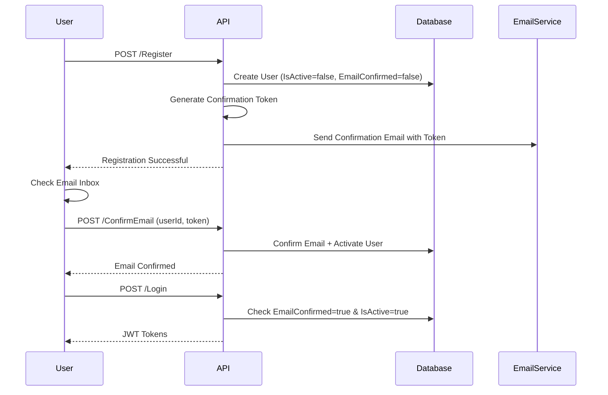

# Complete Email Confirmation Flow Implementation

## Overview

Implement production-ready email confirmation flow where users must verify their email address before they can login.

## Current State Analysis

### Issues Found

1. **RegisterCommandHandler.cs** - Sends welcome email but no confirmation token
2. **LoginCommandHandler.cs** - Email confirmation checks are commented out (lines 43-52)
3. **ConfirmEmailCommandHandler.cs** - Only confirms email, doesn't activate user account

## Flow Diagram



## Implementation Plan

### 1. Update RegisterCommandHandler.cs

**File**: [Sudan_Train.Core/Features/Authentication/Commands/Register/RegisterCommandHandler.cs](Sudan_Train.Core/Features/Authentication/Commands/Register/RegisterCommandHandler.cs)

#### Changes:

**a) Modify Handle method** (after line 48):

```csharp
var user = await CreateUserAsync(request);
if (user == null)
    return BadRequest<object>(_authLocalizer[AuthenticationResourcesKeys.FailedToAddUser]);

// Generate confirmation token
var confirmationToken = await _userManager.GenerateEmailConfirmationTokenAsync(user);

// Send confirmation email (instead of welcome email)
await SendConfirmationEmailAsync(user, confirmationToken, cancellationToken);

return Created<object>(
    _authLocalizer[AuthenticationResourcesKeys.UserRegisteredSuccessfully],
    entity: new { Message = "Please check your email to confirm your account." });
```

**b) Replace SendWelcomeEmailAsync method** with SendConfirmationEmailAsync:

```csharp
private async Task SendConfirmationEmailAsync(User user, string token, CancellationToken cancellationToken)
{
    try
    {
        var messagingApiUrl = _configuration[MessagingApiBaseUrlKey];
        if (string.IsNullOrEmpty(messagingApiUrl))
        {
            _logger.LogWarning("MessagingApi BaseUrl not configured. Confirmation email not sent.");
            return;
        }

        var emailRequest = BuildConfirmationEmailRequest(user, token);
        await SendEmailRequestAsync(messagingApiUrl, emailRequest, cancellationToken);

        _logger.LogInformation("Confirmation email queued successfully for {Email}", user.Email);
    }
    catch (Exception ex)
    {
        _logger.LogError(ex, "Failed to send confirmation email to {Email}", user.Email);
    }
}

private object BuildConfirmationEmailRequest(User user, string token)
{
    var encodedToken = System.Web.HttpUtility.UrlEncode(token);
    var encodedUserId = user.Id;
    
    // Confirmation URL (update domain as needed)
    var confirmationUrl = $"https://yourdomain.com/confirm-email?userId={encodedUserId}&code={encodedToken}";
    
    var emailSubject = "Confirm Your Email - Sudan Train";
    var emailBody = $@"
        <h2>Welcome to Sudan Train, {user.FirstName}!</h2>
        <p>Thank you for registering. Please confirm your email address to activate your account.</p>
        <p><a href='{confirmationUrl}' style='background-color: #007bff; color: white; padding: 10px 20px; text-decoration: none; border-radius: 5px; display: inline-block;'>Confirm Email</a></p>
        <p>Or copy this link: {confirmationUrl}</p>
        <p><strong>User ID:</strong> {user.Id}</p>
        <p><strong>Confirmation Code:</strong> {token}</p>
        <p>This link will expire in 24 hours.</p>
        <p>If you didn't create this account, please ignore this email.</p>";

    return new
    {
        to = user.Email,
        subject = emailSubject,
        body = emailBody,
        isHtml = true,
        strategy = EmailSendingStrategy.Queued.ToIntValue()
    };
}
```

**c) Add using directive** at top of file:

```csharp
using System.Web;
```

### 2. Update ConfirmEmailCommandHandler.cs

**File**: [Sudan_Train.Core/Features/Authentication/Commands/ConfirmEmail/ConfirmEmailCommandHandler.cs](Sudan_Train.Core/Features/Authentication/Commands/ConfirmEmail/ConfirmEmailCommandHandler.cs)

**Modify Handle method** (after line 44, before return):

```csharp
// Confirm email
var result = await _userManager.ConfirmEmailAsync(user, request.Code);

if (!result.Succeeded)
{
    var errors = string.Join(", ", result.Errors.Select(e => e.Description));
    return BadRequest<string>(errors);
}

// Activate user account
user.IsActive = true;
await _userManager.UpdateAsync(user);

return Success<string>("Email confirmed successfully. You can now login.");
```

### 3. Restore Security Checks in LoginCommandHandler.cs

**File**: [Sudan_Train.Core/Features/Authentication/Commands/Login/LoginCommandHandler.cs](Sudan_Train.Core/Features/Authentication/Commands/Login/LoginCommandHandler.cs)

**Uncomment lines 43-52**:

```csharp
// Check if user is active
if (!user.IsActive)
{
    return Unauthorized<JwtAuthResult>(_authLocalizer[AuthenticationResourcesKeys.UserIsNotActive]);
}

// Check if email is confirmed
if (!user.EmailConfirmed)
{
    return Unauthorized<JwtAuthResult>(_authLocalizer[AuthenticationResourcesKeys.EmailNotConfirmed]);
}
```

**Also uncomment lines 55-58** (lockout check):

```csharp
// Check if account is locked out
if (signInResult.IsLockedOut)
{
    return Unauthorized<JwtAuthResult>(_authLocalizer[AuthenticationResourcesKeys.AccountLockedOut]);
}
```

### 4. Update Postman Collection Documentation

**File**: [POSTMAN_TESTING_GUIDE.md](POSTMAN_TESTING_GUIDE.md)

Add note in **"01. Registration & Email Confirmation"** section:

````markdown
### Important: Email Confirmation Required

After registration:
1. Check the email inbox (or console logs if email not configured)
2. Find the confirmation code in the email
3. Use the userId and code in the "Confirm Email" request
4. Only after confirmation can you login

If email service is not configured, check API logs:
```bash
docker-compose logs train-api | grep "Confirmation Code"
````

The confirmation token will be logged there.

````

## Files to Modify

1. [RegisterCommandHandler.cs](Sudan_Train.Core/Features/Authentication/Commands/Register/RegisterCommandHandler.cs)
   - Generate email confirmation token
   - Send confirmation email with link and code
   - Keep user IsActive = false

2. [ConfirmEmailCommandHandler.cs](Sudan_Train.Core/Features/Authentication/Commands/ConfirmEmail/ConfirmEmailCommandHandler.cs)
   - Set user.IsActive = true after email confirmation

3. [LoginCommandHandler.cs](Sudan_Train.Core/Features/Authentication/Commands/Login/LoginCommandHandler.cs)
   - Uncomment EmailConfirmed check (lines 43-52)
   - Uncomment IsActive check
   - Uncomment IsLockedOut check (lines 55-58)

4. [POSTMAN_TESTING_GUIDE.md](POSTMAN_TESTING_GUIDE.md)
   - Add email confirmation instructions

## Testing Flow

### Step 1: Register
```http
POST /Api/V1/Authentication/Register
{
  "userName": "testuser1",
  "email": "test@example.com",
  "password": "Test@123456",
  "confirmPassword": "Test@123456",
  "firstName": "Test",
  "lastName": "User"
}
````

**Response**: Registration successful, check email

### Step 2: Check Email / Logs

- **Email**: Look for confirmation email with userId and code
- **Logs**: `docker-compose logs train-api` for the token

### Step 3: Confirm Email

```http
POST /Api/V1/Authentication/ConfirmEmail
{
  "userId": 1,
  "code": "CONFIRMATION_TOKEN_FROM_EMAIL"
}
```

**Response**: Email confirmed successfully

### Step 4: Login

```http
POST /Api/V1/Authentication/Login
{
  "userName": "testuser1",
  "password": "Test@123456"
}
```

**Response**: JWT tokens

### Error Cases

**Try to login before confirmation**:

- Status: 401 Unauthorized
- Message: "Please confirm your email before logging in"

**Invalid confirmation code**:

- Status: 400 Bad Request
- Message: "Invalid token" or token errors

## Security Benefits

1. Verifies email ownership
2. Prevents fake account creation
3. Ensures valid contact information
4. Production-ready security standard
5. Reduces spam registrations

## Configuration Notes

### Email Service Setup Required

Ensure `MessagingApi:BaseUrl` is configured in `appsettings.json`:

```json
{
  "MessagingApi": {
    "BaseUrl": "http://messaging-api:5001"
  }
}
```

### Token Expiration

By default, ASP.NET Identity confirmation tokens expire in 24 hours. This is configured in the Identity setup.

## Rollback Plan

If issues arise, temporarily allow unconfirmed logins by commenting out the checks in LoginCommandHandler.cs again (not recommended for production).