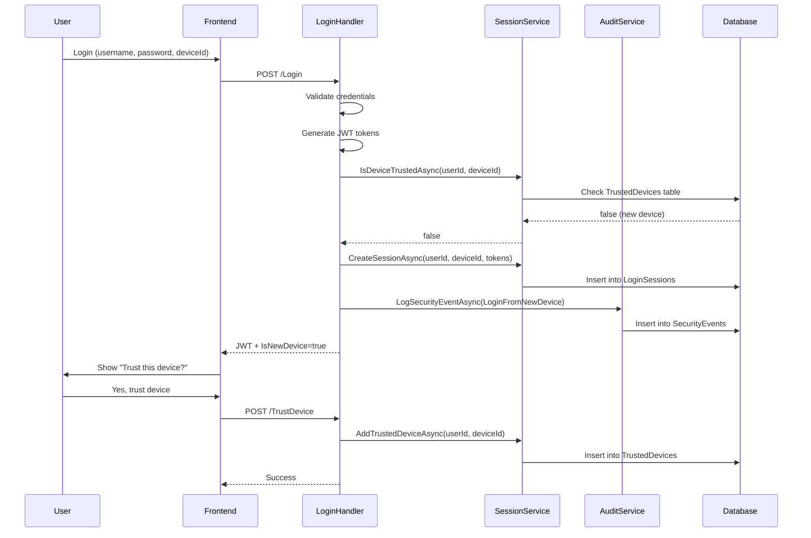

# Integrate Security Modules into Authentication Flow

## Overview

Integrate the existing security entities (LoginSession, TrustedDevice, SecurityEvent, PasswordHistory) into your authentication endpoints to enable:
- Multi-device session tracking
- New device detection and trust management
- Security event logging and notifications
- Password reuse prevention

## Current State

**Already Implemented:**
- All entity models exist in database
- `SessionManagementService` with session and trusted device methods
- `AuditService` with audit logging and security event methods
- `PasswordSecurityService` with password history validation
- `AuditLoggingMiddleware` automatically logs all `/authentication/` requests
- `GetActiveSessionsQuery` to view sessions (already working)

**Missing Integrations:**
- LoginSession not created on login/refresh
- TrustedDevice not checked during login
- SecurityEvent not logged for new devices/locations
- PasswordHistory not validated on password changes

---

## Implementation Plan

### Phase 1: Login Flow Integration

#### 1.1 Update LoginCommand to Include Device Info

**File:** [`Sudan_Train.Core/Features/Authentication/Commands/Login/LoginCommand.cs`](Sudan_Train.Core/Features/Authentication/Commands/Login/LoginCommand.cs)

**Changes:**
```csharp
public class LoginCommand : IRequest<Response<JwtAuthResult>>
{
    public string? UserName { get; set; }
    public string? Password { get; set; }
    
    // New properties for device tracking
    public string? DeviceId { get; set; }  // Optional: Generated by frontend
    public string? DeviceName { get; set; } // e.g., "iPhone 14 Pro", "Chrome on Windows"
}
```

**Note:** DeviceId can be generated by frontend using fingerprinting libraries (e.g., FingerprintJS) or simple UUID stored in localStorage.

#### 1.2 Enhance LoginCommandHandler with Security Integration

**File:** [`Sudan_Train.Core/Features/Authentication/Commands/Login/LoginCommandHandler.cs`](Sudan_Train.Core/Features/Authentication/Commands/Login/LoginCommandHandler.cs)

**Add dependencies:**
```csharp
private readonly ISessionManagementService _sessionService;
private readonly IAuditService _auditService;
private readonly IHttpContextAccessor _httpContextAccessor;
```

**After successful JWT generation (line 74), add:**

```csharp
// Get device and IP info
var httpContext = _httpContextAccessor.HttpContext;
var ipAddress = GetClientIpAddress(httpContext);
var userAgent = httpContext?.Request.Headers["User-Agent"].ToString() ?? "Unknown";
var deviceId = request.DeviceId ?? Guid.NewGuid().ToString();
var deviceName = request.DeviceName ?? ParseDeviceFromUserAgent(userAgent);

// Check if device is trusted
var isTrustedDevice = await _sessionService.IsDeviceTrustedAsync(user.Id, deviceId);

// Create login session
await _sessionService.CreateSessionAsync(
    userId: user.Id,
    deviceId: deviceId,
    deviceName: deviceName,
    ipAddress: ipAddress,
    userAgent: userAgent,
    accessToken: result.AccessToken,
    refreshToken: result.RefreshToken,
    location: null // Optional: Use IP geolocation API
);

// Log security event if new device
if (!isTrustedDevice)
{
    await _auditService.LogSecurityEventAsync(
        userId: user.Id,
        eventType: SecurityEventType.LoginFromNewDevice,
        ipAddress: ipAddress,
        details: $"Login from new device: {deviceName}"
    );
}

// Add device info to response for frontend to prompt "Trust this device?"
result.IsNewDevice = !isTrustedDevice;
result.DeviceId = deviceId;
```

**Add helper methods:**
```csharp
private string GetClientIpAddress(HttpContext? context)
{
    if (context == null) return "Unknown";
    
    var forwardedFor = context.Request.Headers["X-Forwarded-For"].ToString();
    if (!string.IsNullOrEmpty(forwardedFor))
        return forwardedFor.Split(',')[0].Trim();
    
    return context.Connection.RemoteIpAddress?.ToString() ?? "Unknown";
}

private string ParseDeviceFromUserAgent(string userAgent)
{
    // Simple parser - can be enhanced
    if (userAgent.Contains("iPhone")) return "iPhone";
    if (userAgent.Contains("Android")) return "Android Device";
    if (userAgent.Contains("Windows")) return "Windows PC";
    if (userAgent.Contains("Mac")) return "Mac";
    return "Unknown Device";
}
```

#### 1.3 Update JwtAuthResult to Include Device Info

**File:** [`Sudan_Train.Data/Results/JwtAuthResult.cs`](Sudan_Train.Data/Results/JwtAuthResult.cs)

**Add properties:**
```csharp
public bool IsNewDevice { get; set; }
public string? DeviceId { get; set; }
```

---

### Phase 2: Refresh Token Integration

#### 2.1 Update RefreshTokenCommand

**File:** [`Sudan_Train.Core/Features/Authentication/Commands/RefreshToken/RefreshTokenCommand.cs`](Sudan_Train.Core/Features/Authentication/Commands/RefreshToken/RefreshTokenCommand.cs)

**Add:**
```csharp
public string? DeviceId { get; set; }
```

#### 2.2 Update RefreshTokenCommandHandler

**File:** [`Sudan_Train.Core/Features/Authentication/Commands/RefreshToken/RefreshTokenCommandHandler.cs`](Sudan_Train.Core/Features/Authentication/Commands/RefreshToken/RefreshTokenCommandHandler.cs)

**After successful token refresh (line 62), add:**
```csharp
// Update session activity
if (!string.IsNullOrEmpty(request.AccessToken))
{
    await _sessionService.UpdateSessionActivityAsync(request.AccessToken);
}

// Create new session with new tokens
if (!string.IsNullOrEmpty(request.DeviceId))
{
    var httpContext = _httpContextAccessor.HttpContext;
    var ipAddress = GetClientIpAddress(httpContext);
    var userAgent = httpContext?.Request.Headers["User-Agent"].ToString() ?? "Unknown";
    var deviceName = httpContext?.Request.Headers["Device-Name"].ToString() ?? "Unknown Device";
    
    await _sessionService.CreateSessionAsync(
        userId: user.Id,
        deviceId: request.DeviceId,
        deviceName: deviceName,
        ipAddress: ipAddress,
        userAgent: userAgent,
        accessToken: result.AccessToken,
        refreshToken: result.RefreshToken
    );
}
```

---

### Phase 3: Password Security Integration

#### 3.1 Update ChangePasswordCommandHandler

**File:** [`Sudan_Train.Core/Features/Authentication/Commands/ChangePassword/ChangePasswordCommandHandler.cs`](Sudan_Train.Core/Features/Authentication/Commands/ChangePassword/ChangePasswordCommandHandler.cs)

**Add dependency:**
```csharp
private readonly IPasswordSecurityService _passwordSecurityService;
private readonly IAuditService _auditService;
```

**Before changing password (before line 56), add:**
```csharp
// Check if password is in recent history
var isReused = await _passwordSecurityService.IsPasswordInHistoryAsync(user.Id, request.NewPassword, historyCount: 5);
if (isReused)
{
    return BadRequest<string>("Cannot reuse one of your last 5 passwords. Please choose a different password.");
}

// Check password strength (optional, already validated by Identity)
var strength = await _passwordSecurityService.CheckPasswordStrengthAsync(request.NewPassword);
if (strength.Score < 2)
{
    return BadRequest<string>($"Password is too weak. {string.Join(", ", strength.Feedback)}");
}
```

**After successful password change (after line 63), add:**
```csharp
// Add current password to history
var currentPasswordHash = user.PasswordHash;
if (!string.IsNullOrEmpty(currentPasswordHash))
{
    await _passwordSecurityService.AddToPasswordHistoryAsync(user.Id, currentPasswordHash);
}

// Update PasswordChangedAt timestamp
user.PasswordChangedAt = DateTime.UtcNow;
await _userManager.UpdateAsync(user);

// Log security event
var ipAddress = _httpContextAccessor.HttpContext?.Connection?.RemoteIpAddress?.ToString() ?? "Unknown";
await _auditService.LogSecurityEventAsync(
    userId: user.Id,
    eventType: SecurityEventType.PasswordChanged,
    ipAddress: ipAddress,
    details: "Password changed via ChangePassword endpoint"
);
```

#### 3.2 Update ResetPasswordCommandHandler

**File:** [`Sudan_Train.Core/Features/Authentication/Commands/ResetPassword/ResetPasswordCommandHandler.cs`](Sudan_Train.Core/Features/Authentication/Commands/ResetPassword/ResetPasswordCommandHandler.cs)

**Add dependency:**
```csharp
private readonly IPasswordSecurityService _passwordSecurityService;
private readonly IHttpContextAccessor _httpContextAccessor;
```

**Before resetting password (before line 72), add:**
```csharp
// Check password history
var isReused = await _passwordSecurityService.IsPasswordInHistoryAsync(user.Id, request.NewPassword, historyCount: 5);
if (isReused)
{
    return BadRequest<string>("Cannot reuse one of your last 5 passwords. Please choose a different password.");
}
```

**After successful reset (after line 90), add:**
```csharp
// Add old password to history
if (!string.IsNullOrEmpty(user.PasswordHash))
{
    await _passwordSecurityService.AddToPasswordHistoryAsync(user.Id, user.PasswordHash);
}

// Update timestamp
user.PasswordChangedAt = DateTime.UtcNow;
await _userManager.UpdateAsync(user);

// Log security event
var ipAddress = _httpContextAccessor.HttpContext?.Connection?.RemoteIpAddress?.ToString() ?? "Unknown";
await _auditService.LogSecurityEventAsync(
    userId: user.Id,
    eventType: SecurityEventType.PasswordChanged,
    ipAddress: ipAddress,
    details: "Password reset via reset code"
);
```

---

### Phase 4: New Endpoints for Device & Security Management

#### 4.1 Create TrustDeviceCommand

**File:** Create `Sudan_Train.Core/Features/Authentication/Commands/TrustDevice/TrustDeviceCommand.cs`

```csharp
using MediatR;
using Sudan_Train.Core.Bases;

namespace Sudan_Train.Core.Features.Authentication.Commands.TrustDevice
{
    public class TrustDeviceCommand : IRequest<Response<string>>
    {
        public string DeviceId { get; set; } = default!;
        public string DeviceName { get; set; } = default!;
        public string? DeviceFingerprint { get; set; }
    }
}
```

#### 4.2 Create TrustDeviceCommandHandler

**File:** Create `Sudan_Train.Core/Features/Authentication/Commands/TrustDevice/TrustDeviceCommandHandler.cs`

```csharp
using MediatR;
using Microsoft.AspNetCore.Http;
using Microsoft.Extensions.Localization;
using Sudan_Train.Core.Bases;
using Sudan_Train.Core.Resources.Authentication;
using Sudan_Train.Service.Abstracts;
using System.Security.Claims;
using System.Threading;
using System.Threading.Tasks;

namespace Sudan_Train.Core.Features.Authentication.Commands.TrustDevice
{
    public class TrustDeviceCommandHandler : ResponseHandler, IRequestHandler<TrustDeviceCommand, Response<string>>
    {
        private readonly ISessionManagementService _sessionService;
        private readonly IHttpContextAccessor _httpContextAccessor;
        private readonly IStringLocalizer<AuthenticationResources> _authLocalizer;

        public TrustDeviceCommandHandler(
            ISessionManagementService sessionService,
            IHttpContextAccessor httpContextAccessor,
            IStringLocalizer<AuthenticationResources> authLocalizer) : base(authLocalizer)
        {
            _sessionService = sessionService;
            _httpContextAccessor = httpContextAccessor;
            _authLocalizer = authLocalizer;
        }

        public async Task<Response<string>> Handle(TrustDeviceCommand request, CancellationToken cancellationToken)
        {
            var userIdClaim = _httpContextAccessor.HttpContext?.User.FindFirst(ClaimTypes.NameIdentifier)?.Value
                ?? _httpContextAccessor.HttpContext?.User.FindFirst("uid")?.Value;

            if (string.IsNullOrEmpty(userIdClaim) || !int.TryParse(userIdClaim, out int userId))
            {
                return Unauthorized<string>(_authLocalizer[AuthenticationResourcesKeys.UserNotFound]);
            }

            var fingerprint = request.DeviceFingerprint ?? Guid.NewGuid().ToString();

            await _sessionService.AddTrustedDeviceAsync(userId, request.DeviceId, request.DeviceName, fingerprint);

            return Success<string>("Device trusted successfully");
        }
    }
}
```

#### 4.3 Create GetTrustedDevicesQuery

**File:** Create `Sudan_Train.Core/Features/Authentication/Queries/GetTrustedDevices/GetTrustedDevicesQuery.cs`

```csharp
using MediatR;
using Sudan_Train.Core.Bases;
using Sudan_Train.Data.Entity.Identity;

namespace Sudan_Train.Core.Features.Authentication.Queries.GetTrustedDevices
{
    public class GetTrustedDevicesQuery : IRequest<Response<List<TrustedDevice>>>
    {
    }
}
```

#### 4.4 Create GetTrustedDevicesQueryHandler

**File:** Create `Sudan_Train.Core/Features/Authentication/Queries/GetTrustedDevices/GetTrustedDevicesQueryHandler.cs`

```csharp
using MediatR;
using Microsoft.AspNetCore.Http;
using Microsoft.Extensions.Localization;
using Sudan_Train.Core.Bases;
using Sudan_Train.Core.Resources.Authentication;
using Sudan_Train.Data.Entity.Identity;
using Sudan_Train.Service.Abstracts;
using System.Security.Claims;

namespace Sudan_Train.Core.Features.Authentication.Queries.GetTrustedDevices
{
    public class GetTrustedDevicesQueryHandler : ResponseHandler, IRequestHandler<GetTrustedDevicesQuery, Response<List<TrustedDevice>>>
    {
        private readonly ISessionManagementService _sessionService;
        private readonly IHttpContextAccessor _httpContextAccessor;
        private readonly IStringLocalizer<AuthenticationResources> _authLocalizer;

        public GetTrustedDevicesQueryHandler(
            ISessionManagementService sessionService,
            IHttpContextAccessor httpContextAccessor,
            IStringLocalizer<AuthenticationResources> authLocalizer) : base(authLocalizer)
        {
            _sessionService = sessionService;
            _httpContextAccessor = httpContextAccessor;
            _authLocalizer = authLocalizer;
        }

        public async Task<Response<List<TrustedDevice>>> Handle(GetTrustedDevicesQuery request, CancellationToken cancellationToken)
        {
            var userIdClaim = _httpContextAccessor.HttpContext?.User.FindFirst(ClaimTypes.NameIdentifier)?.Value
                ?? _httpContextAccessor.HttpContext?.User.FindFirst("uid")?.Value;

            if (string.IsNullOrEmpty(userIdClaim) || !int.TryParse(userIdClaim, out int userId))
            {
                return Unauthorized<List<TrustedDevice>>(_authLocalizer[AuthenticationResourcesKeys.UserNotFound]);
            }

            var devices = await _sessionService.GetTrustedDevicesAsync(userId);

            return Success<List<TrustedDevice>>(entity: devices);
        }
    }
}
```

#### 4.5 Create RemoveTrustedDeviceCommand

**File:** Create `Sudan_Train.Core/Features/Authentication/Commands/RemoveTrustedDevice/RemoveTrustedDeviceCommand.cs`

```csharp
using MediatR;
using Sudan_Train.Core.Bases;

namespace Sudan_Train.Core.Features.Authentication.Commands.RemoveTrustedDevice
{
    public class RemoveTrustedDeviceCommand : IRequest<Response<string>>
    {
        public int DeviceId { get; set; }
    }
}
```

#### 4.6 Create RemoveTrustedDeviceCommandHandler

**File:** Create `Sudan_Train.Core/Features/Authentication/Commands/RemoveTrustedDevice/RemoveTrustedDeviceCommandHandler.cs`

```csharp
using MediatR;
using Microsoft.AspNetCore.Http;
using Microsoft.Extensions.Localization;
using Sudan_Train.Core.Bases;
using Sudan_Train.Core.Resources.Authentication;
using Sudan_Train.Service.Abstracts;
using System.Security.Claims;

namespace Sudan_Train.Core.Features.Authentication.Commands.RemoveTrustedDevice
{
    public class RemoveTrustedDeviceCommandHandler : ResponseHandler, IRequestHandler<RemoveTrustedDeviceCommand, Response<string>>
    {
        private readonly ISessionManagementService _sessionService;
        private readonly IHttpContextAccessor _httpContextAccessor;
        private readonly IStringLocalizer<AuthenticationResources> _authLocalizer;

        public RemoveTrustedDeviceCommandHandler(
            ISessionManagementService sessionService,
            IHttpContextAccessor httpContextAccessor,
            IStringLocalizer<AuthenticationResources> authLocalizer) : base(authLocalizer)
        {
            _sessionService = sessionService;
            _httpContextAccessor = httpContextAccessor;
            _authLocalizer = authLocalizer;
        }

        public async Task<Response<string>> Handle(RemoveTrustedDeviceCommand request, CancellationToken cancellationToken)
        {
            var userIdClaim = _httpContextAccessor.HttpContext?.User.FindFirst(ClaimTypes.NameIdentifier)?.Value
                ?? _httpContextAccessor.HttpContext?.User.FindFirst("uid")?.Value;

            if (string.IsNullOrEmpty(userIdClaim) || !int.TryParse(userIdClaim, out int userId))
            {
                return Unauthorized<string>(_authLocalizer[AuthenticationResourcesKeys.UserNotFound]);
            }

            var result = await _sessionService.RemoveTrustedDeviceAsync(request.DeviceId, userId);

            if (!result)
            {
                return NotFound<string>("Device not found or already removed");
            }

            return Success<string>("Trusted device removed successfully");
        }
    }
}
```

#### 4.7 Create GetSecurityEventsQuery

**File:** Create `Sudan_Train.Core/Features/Authentication/Queries/GetSecurityEvents/GetSecurityEventsQuery.cs`

```csharp
using MediatR;
using Sudan_Train.Core.Bases;
using Sudan_Train.Data.Entity.Identity;

namespace Sudan_Train.Core.Features.Authentication.Queries.GetSecurityEvents
{
    public class GetSecurityEventsQuery : IRequest<Response<List<SecurityEvent>>>
    {
        public int PageNumber { get; set; } = 1;
        public int PageSize { get; set; } = 20;
    }
}
```

#### 4.8 Create GetSecurityEventsQueryHandler

**File:** Create `Sudan_Train.Core/Features/Authentication/Queries/GetSecurityEvents/GetSecurityEventsQueryHandler.cs`

```csharp
using MediatR;
using Microsoft.AspNetCore.Http;
using Microsoft.Extensions.Localization;
using Sudan_Train.Core.Bases;
using Sudan_Train.Core.Resources.Authentication;
using Sudan_Train.Data.Entity.Identity;
using Sudan_Train.Service.Abstracts;
using System.Security.Claims;

namespace Sudan_Train.Core.Features.Authentication.Queries.GetSecurityEvents
{
    public class GetSecurityEventsQueryHandler : ResponseHandler, IRequestHandler<GetSecurityEventsQuery, Response<List<SecurityEvent>>>
    {
        private readonly IAuditService _auditService;
        private readonly IHttpContextAccessor _httpContextAccessor;
        private readonly IStringLocalizer<AuthenticationResources> _authLocalizer;

        public GetSecurityEventsQueryHandler(
            IAuditService auditService,
            IHttpContextAccessor httpContextAccessor,
            IStringLocalizer<AuthenticationResources> authLocalizer) : base(authLocalizer)
        {
            _auditService = auditService;
            _httpContextAccessor = httpContextAccessor;
            _authLocalizer = authLocalizer;
        }

        public async Task<Response<List<SecurityEvent>>> Handle(GetSecurityEventsQuery request, CancellationToken cancellationToken)
        {
            var userIdClaim = _httpContextAccessor.HttpContext?.User.FindFirst(ClaimTypes.NameIdentifier)?.Value
                ?? _httpContextAccessor.HttpContext?.User.FindFirst("uid")?.Value;

            if (string.IsNullOrEmpty(userIdClaim) || !int.TryParse(userIdClaim, out int userId))
            {
                return Unauthorized<List<SecurityEvent>>(_authLocalizer[AuthenticationResourcesKeys.UserNotFound]);
            }

            var events = await _auditService.GetUserSecurityEventsAsync(userId, request.PageNumber, request.PageSize);

            return Success<List<SecurityEvent>>(entity: events);
        }
    }
}
```

#### 4.9 Add New Routes to AuthenticationController

**File:** [`Sudan_Train/Controllers/AuthenticationController.cs`](Sudan_Train/Controllers/AuthenticationController.cs)

**Add after line 315 (in Account Management section):**

```csharp
/// <summary>
/// Get all trusted devices for current user
/// </summary>
[Authorize]
[HttpGet(Router.AccountGetTrustedDevices)]
public async Task<IActionResult> GetTrustedDevices([FromQuery] GetTrustedDevicesQuery query)
{
    return NewResult(await Mediator.Send(query));
}

/// <summary>
/// Trust current device to skip 2FA on future logins
/// </summary>
[Authorize]
[HttpPost(Router.AccountTrustDevice)]
public async Task<IActionResult> TrustDevice([FromBody] TrustDeviceCommand command)
{
    return NewResult(await Mediator.Send(command));
}

/// <summary>
/// Remove a trusted device
/// </summary>
[Authorize]
[HttpDelete(Router.AccountRemoveTrustedDevice)]
public async Task<IActionResult> RemoveTrustedDevice([FromBody] RemoveTrustedDeviceCommand command)
{
    return NewResult(await Mediator.Send(command));
}

/// <summary>
/// Get security events (login alerts, password changes, etc.)
/// </summary>
[Authorize]
[HttpGet(Router.AccountGetSecurityEvents)]
public async Task<IActionResult> GetSecurityEvents([FromQuery] GetSecurityEventsQuery query)
{
    return NewResult(await Mediator.Send(query));
}
```

#### 4.10 Add New Routes to Router Configuration

**File:** [`Sudan_Train.Data/AppMetaData/Router.cs`](Sudan_Train.Data/AppMetaData/Router.cs)

**Add in Account section:**
```csharp
public const string AccountGetTrustedDevices = AccountRouting + "/trusted-devices";
public const string AccountTrustDevice = AccountRouting + "/trust-device";
public const string AccountRemoveTrustedDevice = AccountRouting + "/trusted-devices/remove";
public const string AccountGetSecurityEvents = AccountRouting + "/security-events";
```

---

## Integration Flow Diagram



---

## Testing Plan

### Test LoginSession Integration

```http
POST /Api/V1/Authentication/Login
{
  "userName": "test",
  "password": "Test@123456",
  "deviceId": "device-uuid-123",
  "deviceName": "iPhone 14 Pro"
}
```

**Expected:**
- `LoginSession` created in database
- `SecurityEvent` created if new device
- Response includes `IsNewDevice: true`

**Verify:**
```sql
SELECT * FROM security.LoginSessions WHERE UserId = 1;
SELECT * FROM security.SecurityEvents WHERE UserId = 1;
```

### Test TrustedDevice

```http
POST /Api/V1/Account/TrustDevice
Authorization: Bearer <token>
{
  "deviceId": "device-uuid-123",
  "deviceName": "iPhone 14 Pro"
}
```

**Verify:**
```sql
SELECT * FROM security.TrustedDevices WHERE UserId = 1;
```

### Test Password History

```http
POST /Api/V1/Authentication/ChangePassword
Authorization: Bearer <token>
{
  "currentPassword": "Test@123456",
  "newPassword": "Test@123456",  // Same password
  "confirmPassword": "Test@123456"
}
```

**Expected:**
```json
{
  "succeeded": false,
  "message": "Cannot reuse one of your last 5 passwords. Please choose a different password."
}
```

### Test View Sessions

```http
GET /Api/V1/Account/Sessions
Authorization: Bearer <token>
```

**Expected:**
```json
{
  "succeeded": true,
  "data": [
    {
      "sessionId": 1,
      "deviceInfo": "iPhone 14 Pro",
      "ipAddress": "192.168.1.100",
      "loginTime": "2024-12-16T10:00:00Z",
      "lastActivity": "2024-12-16T10:30:00Z",
      "isCurrent": true
    }
  ]
}
```

---

## Benefits

1. **Multi-Device Management**: Users can see all active sessions and logout remotely
2. **Security Alerts**: Users notified of logins from new devices
3. **Device Trust**: Reduce friction by trusting frequently used devices
4. **Password Security**: Prevent password reuse and enforce strong passwords
5. **Audit Trail**: Complete history of authentication events
6. **Compliance**: GDPR-ready with full activity logging

---

## Optional Enhancements (Future)

1. **IP Geolocation**: Add location to sessions using MaxMind GeoIP
2. **Email Notifications**: Send emails for security events (already has service)
3. **Risk-Based Authentication**: Require 2FA from suspicious IPs
4. **Session Timeout**: Auto-logout inactive sessions after X hours
5. **Device Fingerprinting**: Use advanced browser fingerprinting
6. **Suspicious Activity Detection**: ML-based anomaly detection

---

## Files Summary

### Modified Files (5)
1. `LoginCommand.cs` - Add device info properties
2. `LoginCommandHandler.cs` - Create sessions, check trust, log events
3. `RefreshTokenCommand.cs` - Add deviceId
4. `RefreshTokenCommandHandler.cs` - Update session activity
5. `ChangePasswordCommandHandler.cs` - Check password history, log events
6. `ResetPasswordCommandHandler.cs` - Check password history, log events
7. `JwtAuthResult.cs` - Add IsNewDevice, DeviceId
8. `AuthenticationController.cs` - Add 4 new endpoints
9. `Router.cs` - Add 4 new routes

### New Files (8)
1. `TrustDeviceCommand.cs`
2. `TrustDeviceCommandHandler.cs`
3. `RemoveTrustedDeviceCommand.cs`
4. `RemoveTrustedDeviceCommandHandler.cs`
5. `GetTrustedDevicesQuery.cs`
6. `GetTrustedDevicesQueryHandler.cs`
7. `GetSecurityEventsQuery.cs`
8. `GetSecurityEventsQueryHandler.cs`

---

## Database Impact

All tables already exist:
- `security.LoginSessions` - Will start populating on login
- `security.TrustedDevices` - Will populate when users trust devices
- `security.SecurityEvents` - Will populate on security-related actions
- `security.PasswordHistories` - Will populate on password changes
- `security.AuditLogs` - Already populating via middleware

**No migrations needed** - all tables exist from previous implementation.