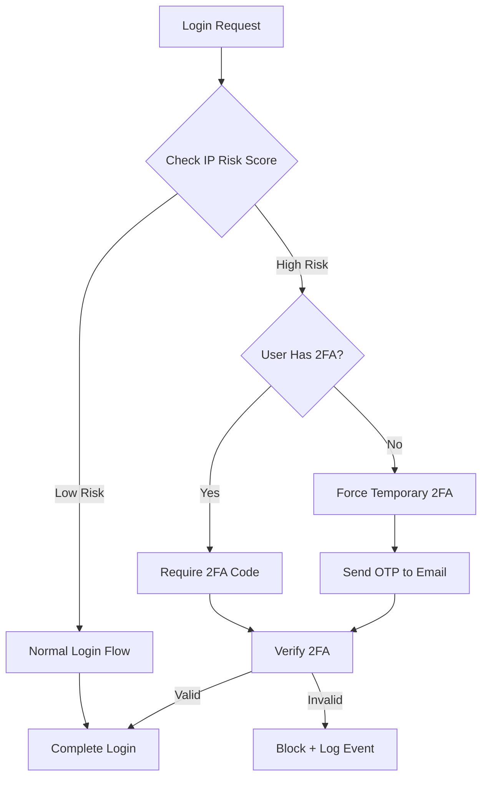

# Security Enhancements Implementation

## Overview

Implement three security enhancements:
1. Email notifications for security events (integrate existing service)
2. Risk-based authentication (force 2FA from suspicious IPs)
3. Session timeout (auto-logout inactive sessions with configurable duration)

---

## Phase 1: Configuration Setup

### 1.1 Add Security Settings to appsettings.json

Add new configuration section to [`Sudan_Train/appsettings.json`](Sudan_Train/appsettings.json):

```json
"SecuritySettings": {
  "SessionTimeout": {
    "Enabled": true,
    "InactivityMinutes": 480,
    "CheckIntervalMinutes": 5
  },
  "RiskBasedAuth": {
    "Enabled": true,
    "MaxFailedAttemptsPerIp": 10,
    "FailedAttemptWindowMinutes": 60,
    "RequireTwoFactorForSuspiciousIp": true,
    "BlockSuspiciousIpMinutes": 30
  },
  "EmailNotifications": {
    "Enabled": true,
    "NotifyOnNewDeviceLogin": true,
    "NotifyOnPasswordChange": true,
    "NotifyOnSessionTerminated": true,
    "NotifyOnSuspiciousActivity": true
  }
}
```

### 1.2 Create Settings Classes

Create `Sudan_Train.Service/Models/SecuritySettings.cs`:

```csharp
public class SecuritySettings
{
    public SessionTimeoutSettings SessionTimeout { get; set; }
    public RiskBasedAuthSettings RiskBasedAuth { get; set; }
    public EmailNotificationSettings EmailNotifications { get; set; }
}

public class SessionTimeoutSettings
{
    public bool Enabled { get; set; } = true;
    public int InactivityMinutes { get; set; } = 480;
    public int CheckIntervalMinutes { get; set; } = 5;
}

public class RiskBasedAuthSettings
{
    public bool Enabled { get; set; } = true;
    public int MaxFailedAttemptsPerIp { get; set; } = 10;
    public int FailedAttemptWindowMinutes { get; set; } = 60;
    public bool RequireTwoFactorForSuspiciousIp { get; set; } = true;
    public int BlockSuspiciousIpMinutes { get; set; } = 30;
}

public class EmailNotificationSettings
{
    public bool Enabled { get; set; } = true;
    public bool NotifyOnNewDeviceLogin { get; set; } = true;
    public bool NotifyOnPasswordChange { get; set; } = true;
    public bool NotifyOnSessionTerminated { get; set; } = true;
    public bool NotifyOnSuspiciousActivity { get; set; } = true;
}
```

---

## Phase 2: Email Notifications Integration

### Current State
- `ISecurityNotificationService` already has methods for all events
- `SecurityNotificationService` has full email templates

### 2.1 Integrate into LoginCommandHandler

Update [`LoginCommandHandler.cs`](Sudan_Train.Core/Features/Authentication/Commands/Login/LoginCommandHandler.cs):

```csharp
// Add to constructor
private readonly ISecurityNotificationService _notificationService;
private readonly IOptions<SecuritySettings> _securitySettings;

// After line 118 (after logging security event for new device):
if (_securitySettings.Value.EmailNotifications.Enabled && 
    _securitySettings.Value.EmailNotifications.NotifyOnNewDeviceLogin)
{
    await _notificationService.NotifyNewDeviceLoginAsync(user, deviceName, ipAddress);
}
```

### 2.2 Integrate into TerminateSessionCommandHandler

Modify session termination to send notification:

```csharp
// After terminating session successfully:
if (_securitySettings.Value.EmailNotifications.NotifyOnSessionTerminated)
{
    await _notificationService.NotifySessionTerminatedAsync(user, session.DeviceName);
}
```

### 2.3 Already Integrated (Verify)
- `ChangePasswordCommandHandler` - already calls `_notificationService.NotifyPasswordChangedAsync`
- `ResetPasswordCommandHandler` - needs to add notification

---

## Phase 3: Risk-Based Authentication

### Architecture



### 3.1 Create IP Risk Tracking Entity

Create `Sudan_Train.Data/Entity/Identity/IpLoginAttempt.cs`:

```csharp
public class IpLoginAttempt
{
    [Key]
    public long Id { get; set; }
    
    [Required, MaxLength(50)]
    public string IpAddress { get; set; } = default!;
    
    [Required]
    public DateTime AttemptTime { get; set; }
    
    [Required]
    public bool WasSuccessful { get; set; }
    
    public int? UserId { get; set; }  // Null for unknown users
    
    [MaxLength(256)]
    public string? UserName { get; set; }  // For audit purposes
}
```

### 3.2 Create IRiskAssessmentService

Create `Sudan_Train.Service/Abstracts/IRiskAssessmentService.cs`:

```csharp
public interface IRiskAssessmentService
{
    Task<RiskAssessment> AssessLoginRiskAsync(string ipAddress, int? userId);
    Task RecordLoginAttemptAsync(string ipAddress, int? userId, string? userName, bool wasSuccessful);
    Task<bool> IsIpBlockedAsync(string ipAddress);
    Task BlockIpAsync(string ipAddress, int durationMinutes);
}

public class RiskAssessment
{
    public RiskLevel Level { get; set; }
    public bool RequiresTwoFactor { get; set; }
    public string Reason { get; set; }
    public int FailedAttemptsInWindow { get; set; }
}

public enum RiskLevel { Low, Medium, High, Critical }
```

### 3.3 Implement RiskAssessmentService

Key logic:
- Query `IpLoginAttempt` for failed attempts in configured window
- If count exceeds threshold, mark as high risk
- Return `RequiresTwoFactor = true` for high risk

### 3.4 Update LoginCommandHandler

Add risk check before password verification:

```csharp
// Before line 65 (password check):
var riskAssessment = await _riskAssessmentService.AssessLoginRiskAsync(ipAddress, null);

if (riskAssessment.Level >= RiskLevel.Critical)
{
    return Unauthorized<JwtAuthResult>("Access temporarily blocked due to suspicious activity.");
}

// After successful password check, before JWT generation:
if (riskAssessment.RequiresTwoFactor && !user.TwoFactorEnabled)
{
    // Store pending login in cache/session
    await _authService.SendTemporary2FACodeAsync(user);
    return BadRequest<JwtAuthResult>("Suspicious activity detected. A verification code has been sent to your email.");
}
```

### 3.5 Update JwtAuthResult

Add field to [`JwtAuthResult.cs`](Sudan_Train.Data/Results/JwtAuthResult.cs):

```csharp
public bool RequiresSuspiciousActivityVerification { get; set; }
```

---

## Phase 4: Session Timeout Background Service

### 4.1 Create SessionCleanupService

Create `Sudan_Train.Service/BackgroundServices/SessionCleanupService.cs`:

```csharp
public class SessionCleanupService : BackgroundService
{
    private readonly IServiceProvider _serviceProvider;
    private readonly ILogger<SessionCleanupService> _logger;
    private readonly SecuritySettings _settings;

    protected override async Task ExecuteAsync(CancellationToken stoppingToken)
    {
        if (!_settings.SessionTimeout.Enabled)
        {
            _logger.LogInformation("Session timeout is disabled.");
            return;
        }

        while (!stoppingToken.IsCancellationRequested)
        {
            await CleanupInactiveSessionsAsync();
            await Task.Delay(TimeSpan.FromMinutes(_settings.SessionTimeout.CheckIntervalMinutes), stoppingToken);
        }
    }

    private async Task CleanupInactiveSessionsAsync()
    {
        using var scope = _serviceProvider.CreateScope();
        var context = scope.ServiceProvider.GetRequiredService<ApplicationDBContext>();
        var notificationService = scope.ServiceProvider.GetRequiredService<ISecurityNotificationService>();
        
        var cutoffTime = DateTime.UtcNow.AddMinutes(-_settings.SessionTimeout.InactivityMinutes);
        
        var inactiveSessions = await context.LoginSessions
            .Where(s => s.IsActive && s.LastActivityTime < cutoffTime)
            .Include(s => s.User)
            .ToListAsync();

        foreach (var session in inactiveSessions)
        {
            session.IsActive = false;
            session.LogoutTime = DateTime.UtcNow;
            
            // Optionally notify user
            if (_settings.EmailNotifications.NotifyOnSessionTerminated)
            {
                await notificationService.NotifySessionTerminatedAsync(
                    session.User, 
                    $"{session.DeviceName} (auto-logout due to inactivity)");
            }
        }

        if (inactiveSessions.Any())
        {
            await context.SaveChangesAsync();
            _logger.LogInformation("Terminated {Count} inactive sessions", inactiveSessions.Count);
        }
    }
}
```

### 4.2 Register Background Service

Update [`Program.cs`](Sudan_Train/Program.cs):

```csharp
// After line 48 (OtpCleanupService registration):
builder.Services.AddHostedService<Sudan_Train.Service.BackgroundServices.SessionCleanupService>();
```

### 4.3 Register Settings

Add to service registration:

```csharp
builder.Services.Configure<SecuritySettings>(builder.Configuration.GetSection("SecuritySettings"));
```

---

## Phase 5: Database Migration

### 5.1 Add IpLoginAttempt Table

Create migration for `IpLoginAttempt` entity with index on `(IpAddress, AttemptTime)`.

### 5.2 Register in DbContext

Add to [`ApplicationDBContext.cs`](Sudan_Train.Infrastructure/context/ApplicationDBContext.cs):

```csharp
public DbSet<IpLoginAttempt> IpLoginAttempts { get; set; }
```

---

## Files Summary

### New Files (6)
| File | Purpose |
|------|---------|
| `Sudan_Train.Service/Models/SecuritySettings.cs` | Configuration classes |
| `Sudan_Train.Data/Entity/Identity/IpLoginAttempt.cs` | IP tracking entity |
| `Sudan_Train.Service/Abstracts/IRiskAssessmentService.cs` | Risk assessment interface |
| `Sudan_Train.Service/Implementations/RiskAssessmentService.cs` | Risk assessment implementation |
| `Sudan_Train.Service/BackgroundServices/SessionCleanupService.cs` | Session timeout service |
| `Sudan_Train.Infrastructure/Configurations/IpLoginAttemptConfiguration.cs` | EF configuration |

### Modified Files (7)
| File | Changes |
|------|---------|
| `appsettings.json` | Add SecuritySettings section |
| `Program.cs` | Register settings and background service |
| `ApplicationDBContext.cs` | Add IpLoginAttempts DbSet |
| `LoginCommandHandler.cs` | Add risk check and email notification |
| `ResetPasswordCommandHandler.cs` | Add email notification |
| `TerminateSessionCommandHandler.cs` | Add email notification |
| `ModuleServiceDependencies.cs` | Register new services |

---

## Testing Checklist

- [ ] Session timeout: Verify sessions auto-terminate after configured inactivity period
- [ ] Email notifications: Verify emails sent for new device login, password change, session termination
- [ ] Risk assessment: Verify 2FA required after X failed login attempts from same IP
- [ ] IP blocking: Verify IP gets blocked after exceeding critical threshold
- [ ] Configuration: Verify all settings can be changed via appsettings.json