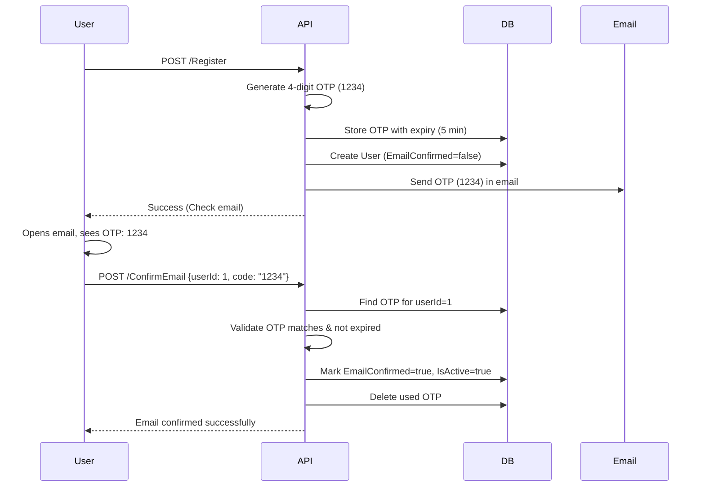

# Simple OTP Email Confirmation Implementation

## Overview

Replace the current complex ASP.NET Identity token system with a simple 4-digit OTP (One-Time Password) for email confirmation. Users will receive a code like "1234" instead of a long token, making it easier to test and use.

## Current Flow vs New Flow

### Current Flow
```
Register → Generate long token (CfDJ8ABC123+XYZ/456==) → Send in email → User copies long token → Confirm
```

### New Flow
```
Register → Generate 4-digit OTP (e.g., 1234) → Store in DB → Send in email → User enters OTP → Validate from DB → Confirm
```

## Architecture Diagram



## Implementation Steps

### Step 1: Create EmailConfirmationOtp Entity

**File:** Create `[Sudan_Train.Data/Entity/Identity/EmailConfirmationOtp.cs](Sudan_Train.Data/Entity/Identity/EmailConfirmationOtp.cs)`

```csharp
using System;
using System.ComponentModel.DataAnnotations;
using System.ComponentModel.DataAnnotations.Schema;

namespace Sudan_Train.Data.Entity.Identity
{
    public class EmailConfirmationOtp
    {
        [Key]
        public int Id { get; set; }

        [Required]
        public int UserId { get; set; }

        [Required]
        [StringLength(4)]
        public string OtpCode { get; set; } = default!;

        [Required]
        public DateTime CreatedAt { get; set; }

        [Required]
        public DateTime ExpiresAt { get; set; }

        public bool IsUsed { get; set; } = false;

        public DateTime? UsedAt { get; set; }

        [ForeignKey(nameof(UserId))]
        public User User { get; set; } = default!;
    }
}
```

**Key Features:**
- 4-character OTP code
- Expiration tracking (default 5 minutes)
- Single-use flag
- Foreign key to User

---

### Step 2: Add DbSet to ApplicationDBContext

**File:** `[Sudan_Train.Infrastructure/context/ApplicationDBContext.cs](Sudan_Train.Infrastructure/context/ApplicationDBContext.cs)`

**Add after line 63:**
```csharp
public DbSet<EmailConfirmationOtp> EmailConfirmationOtps { get; set; }
```

---

### Step 3: Create Entity Configuration

**File:** Create `[Sudan_Train.Infrastructure/Configurations/Identity/EmailConfirmationOtpConfiguration.cs](Sudan_Train.Infrastructure/Configurations/Identity/EmailConfirmationOtpConfiguration.cs)`

```csharp
using Microsoft.EntityFrameworkCore;
using Microsoft.EntityFrameworkCore.Metadata.Builders;
using Sudan_Train.Data.Entity.Identity;

namespace Sudan_Train.Infrastructure.Configurations.Identity
{
    public class EmailConfirmationOtpConfiguration : IEntityTypeConfiguration<EmailConfirmationOtp>
    {
        public void Configure(EntityTypeBuilder<EmailConfirmationOtp> builder)
        {
            builder.ToTable("EmailConfirmationOtps", "security");

            builder.HasKey(e => e.Id);

            builder.Property(e => e.OtpCode)
                .IsRequired()
                .HasMaxLength(4);

            builder.Property(e => e.CreatedAt)
                .IsRequired();

            builder.Property(e => e.ExpiresAt)
                .IsRequired();

            builder.HasIndex(e => new { e.UserId, e.OtpCode })
                .HasDatabaseName("IX_EmailConfirmationOtp_UserId_Code");

            builder.HasIndex(e => e.ExpiresAt)
                .HasDatabaseName("IX_EmailConfirmationOtp_ExpiresAt");

            builder.HasOne(e => e.User)
                .WithMany()
                .HasForeignKey(e => e.UserId)
                .OnDelete(DeleteBehavior.Cascade);
        }
    }
}
```

---

### Step 4: Create Database Migration

**Command to run:**
```bash
cd Sudan_Train.Infrastructure
dotnet ef migrations add AddEmailConfirmationOtp --startup-project ../Sudan_Train
dotnet ef database update --startup-project ../Sudan_Train
```

This will create a new table `security.EmailConfirmationOtps` with columns:
- Id (PK)
- UserId (FK to Users)
- OtpCode (4 chars)
- CreatedAt
- ExpiresAt
- IsUsed
- UsedAt

---

### Step 5: Update RegisterCommandHandler

**File:** `[Sudan_Train.Core/Features/Authentication/Commands/Register/RegisterCommandHandler.cs](Sudan_Train.Core/Features/Authentication/Commands/Register/RegisterCommandHandler.cs)`

**Changes needed:**

1. **Add dependency injection (constructor):**
```csharp
private readonly ApplicationDBContext _context;

public RegisterCommandHandler(
    UserManager<User> userManager,
    IStringLocalizer<AuthenticationResources> authLocalizer,
    IHttpClientFactory httpClientFactory,
    IConfiguration configuration,
    ILogger<RegisterCommandHandler> logger,
    ApplicationDBContext context) : base(authLocalizer)
{
    _userManager = userManager;
    _authLocalizer = authLocalizer;
    _httpClientFactory = httpClientFactory;
    _configuration = configuration;
    _logger = logger;
    _context = context;
}
```

2. **Replace token generation (lines 51-55):**
```csharp
// OLD:
// var confirmationToken = await _userManager.GenerateEmailConfirmationTokenAsync(user);

// NEW: Generate 4-digit OTP
var otpCode = GenerateOtpCode();
await StoreOtpInDatabaseAsync(user.Id, otpCode);

// Send confirmation email with OTP
await SendConfirmationEmailAsync(user, otpCode, cancellationToken);
```

3. **Add helper methods (add after line 138):**
```csharp
private string GenerateOtpCode()
{
    var random = new Random();
    return random.Next(1000, 9999).ToString(); // Generates 1000-9999
}

private async Task StoreOtpInDatabaseAsync(int userId, string otpCode)
{
    // Delete any existing OTPs for this user
    var existingOtps = _context.EmailConfirmationOtps
        .Where(o => o.UserId == userId);
    _context.EmailConfirmationOtps.RemoveRange(existingOtps);

    // Create new OTP
    var otp = new EmailConfirmationOtp
    {
        UserId = userId,
        OtpCode = otpCode,
        CreatedAt = DateTime.UtcNow,
        ExpiresAt = DateTime.UtcNow.AddMinutes(5), // 5 minute expiry
        IsUsed = false
    };

    _context.EmailConfirmationOtps.Add(otp);
    await _context.SaveChangesAsync();
}
```

4. **Update email method signature (line 117):**
```csharp
// Change parameter from 'token' to 'otpCode'
private async Task SendConfirmationEmailAsync(User user, string otpCode, CancellationToken cancellationToken)
```

5. **Update email body building method (line 140):**
```csharp
private object BuildConfirmationEmailRequest(User user, string otpCode)
{
    var emailSubject = "Confirm Your Email - Sudan Train";
    var emailBody = $@"
<!DOCTYPE html>
<html>
<head>
    <meta charset='UTF-8'>
    <style>
        /* ... keep existing styles ... */
        .otp-code {{
            font-size: 48px;
            font-weight: bold;
            color: #007bff;
            text-align: center;
            letter-spacing: 10px;
            padding: 30px;
            background: #f8f9fa;
            border-radius: 10px;
            margin: 30px 0;
            border: 2px dashed #007bff;
        }}
    </style>
</head>
<body>
    <div class='container'>
        <div class='header'>
            <h1>🚂 Sudan Train</h1>
        </div>
        
        <div class='content'>
            <h2>Welcome, {user.FirstName}!</h2>
            <p>Thank you for registering with Sudan Train.</p>
            <p>Your email confirmation code is:</p>
            
            <div class='otp-code'>{otpCode}</div>
            
            <div class='warning'>
                <p><strong>⏰ Important:</strong> This code will expire in 5 minutes.</p>
            </div>
            
            <p><strong>How to confirm:</strong></p>
            <ol>
                <li>Use the Confirm Email endpoint</li>
                <li>Enter your User ID: <strong>{user.Id}</strong></li>
                <li>Enter the code above</li>
            </ol>
        </div>
        
        <div class='footer'>
            <p>Didn't request this code? Ignore this email.</p>
            <p>© 2024 Sudan Train. All rights reserved.</p>
        </div>
    </div>
</body>
</html>";

    return new
    {
        to = user.Email,
        subject = emailSubject,
        body = emailBody,
        isHtml = true,
        strategy = EmailSendingStrategy.Queued.ToIntValue()
    };
}
```

6. **Update logging (line 131):**
```csharp
_logger.LogInformation("Confirmation email queued for {Email}. User ID: {UserId}, OTP: {OtpCode}",
    user.Email, user.Id, otpCode);
```

7. **Add using statement at top:**
```csharp
using Sudan_Train.Infrastructure.context;
using Sudan_Train.Data.Entity.Identity;
```

---

### Step 6: Update ConfirmEmailCommand

**File:** `[Sudan_Train.Core/Features/Authentication/Commands/ConfirmEmail/ConfirmEmailCommand.cs](Sudan_Train.Core/Features/Authentication/Commands/ConfirmEmail/ConfirmEmailCommand.cs)`

**Change Code property:**
```csharp
[StringLength(4, MinimumLength = 4, ErrorMessage = "OTP code must be exactly 4 digits")]
public string Code { get; set; } = default!;
```

---

### Step 7: Update ConfirmEmailCommandHandler

**File:** `[Sudan_Train.Core/Features/Authentication/Commands/ConfirmEmail/ConfirmEmailCommandHandler.cs](Sudan_Train.Core/Features/Authentication/Commands/ConfirmEmail/ConfirmEmailCommandHandler.cs)`

**Complete rewrite:**

```csharp
using MediatR;
using Microsoft.AspNetCore.Identity;
using Microsoft.EntityFrameworkCore;
using Microsoft.Extensions.Localization;
using Sudan_Train.Core.Bases;
using Sudan_Train.Core.Resources.Authentication;
using Sudan_Train.Core.Resources.Shared;
using Sudan_Train.Data.Entity.Identity;
using Sudan_Train.Infrastructure.context;
using System;
using System.Linq;
using System.Threading;
using System.Threading.Tasks;

namespace Sudan_Train.Core.Features.Authentication.Commands.ConfirmEmail
{
    public class ConfirmEmailCommandHandler : ResponseHandler, IRequestHandler<ConfirmEmailCommand, Response<string>>
    {
        private readonly UserManager<User> _userManager;
        private readonly ApplicationDBContext _context;
        private readonly IStringLocalizer<AuthenticationResources> _authLocalizer;
        private readonly IStringLocalizer<SharedResources> _sharedLocalizer;

        public ConfirmEmailCommandHandler(
            IStringLocalizer<SharedResources> sharedLocalizer,
            IStringLocalizer<AuthenticationResources> authLocalizer,
            UserManager<User> userManager,
            ApplicationDBContext context) : base(sharedLocalizer)
        {
            _userManager = userManager;
            _context = context;
            _authLocalizer = authLocalizer;
            _sharedLocalizer = sharedLocalizer;
        }

        public async Task<Response<string>> Handle(ConfirmEmailCommand request, CancellationToken cancellationToken)
        {
            // Find user
            var user = await _userManager.FindByIdAsync(request.UserId.ToString());
            if (user == null)
            {
                return NotFound<string>(_authLocalizer[AuthenticationResourcesKeys.UserNotFound]);
            }

            // Check if already confirmed
            if (user.EmailConfirmed)
            {
                return BadRequest<string>("Email is already confirmed.");
            }

            // Find OTP in database
            var otp = await _context.EmailConfirmationOtps
                .Where(o => o.UserId == request.UserId 
                         && o.OtpCode == request.Code 
                         && !o.IsUsed)
                .FirstOrDefaultAsync(cancellationToken);

            if (otp == null)
            {
                return BadRequest<string>("Invalid OTP code.");
            }

            // Check if expired
            if (otp.ExpiresAt < DateTime.UtcNow)
            {
                return BadRequest<string>("OTP code has expired. Please request a new one.");
            }

            // Mark OTP as used
            otp.IsUsed = true;
            otp.UsedAt = DateTime.UtcNow;
            _context.EmailConfirmationOtps.Update(otp);

            // Confirm email and activate user
            user.EmailConfirmed = true;
            user.IsActive = true;
            await _userManager.UpdateAsync(user);

            await _context.SaveChangesAsync(cancellationToken);

            return Success<string>("Email confirmed successfully. You can now login.");
        }
    }
}
```

**Key changes:**
- Validates OTP from database instead of Identity token
- Checks expiration (5 minutes)
- Marks OTP as used (single-use)
- Activates user account

---

### Step 8: Update ConfirmEmailCommandValidator

**File:** `[Sudan_Train.Core/Features/Authentication/Commands/ConfirmEmail/ConfirmEmailCommandValidator.cs](Sudan_Train.Core/Features/Authentication/Commands/ConfirmEmail/ConfirmEmailCommandValidator.cs)`

**Update validation:**
```csharp
using FluentValidation;

namespace Sudan_Train.Core.Features.Authentication.Commands.ConfirmEmail
{
    public class ConfirmEmailCommandValidator : AbstractValidator<ConfirmEmailCommand>
    {
        public ConfirmEmailCommandValidator()
        {
            RuleFor(x => x.UserId)
                .GreaterThan(0)
                .WithMessage("User ID is required.");

            RuleFor(x => x.Code)
                .NotEmpty()
                .WithMessage("OTP code is required.")
                .Length(4)
                .WithMessage("OTP code must be exactly 4 digits.")
                .Matches(@"^\d{4}$")
                .WithMessage("OTP code must contain only numbers.");
        }
    }
}
```

---

### Step 9: Update Email Template Preview

**File:** `[EMAIL-TEMPLATE-PREVIEW.html](EMAIL-TEMPLATE-PREVIEW.html)`

Replace OTP section to show the new simple code format instead of long URL.

---

### Step 10: Add Cleanup Job (Optional but Recommended)

**File:** Create `[Sudan_Train.Service/BackgroundServices/OtpCleanupService.cs](Sudan_Train.Service/BackgroundServices/OtpCleanupService.cs)`

```csharp
using Microsoft.Extensions.DependencyInjection;
using Microsoft.Extensions.Hosting;
using Microsoft.Extensions.Logging;
using Sudan_Train.Infrastructure.context;
using System;
using System.Linq;
using System.Threading;
using System.Threading.Tasks;

namespace Sudan_Train.Service.BackgroundServices
{
    public class OtpCleanupService : BackgroundService
    {
        private readonly IServiceProvider _serviceProvider;
        private readonly ILogger<OtpCleanupService> _logger;

        public OtpCleanupService(IServiceProvider serviceProvider, ILogger<OtpCleanupService> logger)
        {
            _serviceProvider = serviceProvider;
            _logger = logger;
        }

        protected override async Task ExecuteAsync(CancellationToken stoppingToken)
        {
            while (!stoppingToken.IsCancellationRequested)
            {
                try
                {
                    await CleanupExpiredOtpsAsync();
                    await Task.Delay(TimeSpan.FromMinutes(10), stoppingToken); // Run every 10 minutes
                }
                catch (Exception ex)
                {
                    _logger.LogError(ex, "Error in OTP cleanup service");
                }
            }
        }

        private async Task CleanupExpiredOtpsAsync()
        {
            using var scope = _serviceProvider.CreateScope();
            var context = scope.ServiceProvider.GetRequiredService<ApplicationDBContext>();

            var expiredOtps = context.EmailConfirmationOtps
                .Where(o => o.ExpiresAt < DateTime.UtcNow || o.IsUsed);

            var count = expiredOtps.Count();
            if (count > 0)
            {
                context.EmailConfirmationOtps.RemoveRange(expiredOtps);
                await context.SaveChangesAsync();
                _logger.LogInformation("Cleaned up {Count} expired/used OTPs", count);
            }
        }
    }
}
```

**Register in Program.cs:**
```csharp
builder.Services.AddHostedService<OtpCleanupService>();
```

---

## Testing Guide

### Test via Postman

1. **Register user:**
```http
POST /Api/V1/Authentication/Register
{
  "email": "test@example.com",
  "password": "Test@123456",
  "confirmPassword": "Test@123456",
  "firstName": "Test",
  "lastName": "User"
}
```

2. **Check logs for OTP:**
```bash
docker-compose logs train-api | grep "OTP:"
# Output: OTP: 1234
```

3. **Confirm email:**
```http
POST /Api/V1/Authentication/ConfirmEmail
{
  "userId": 1,
  "code": "1234"
}
```

4. **Login:**
```http
POST /Api/V1/Authentication/Login
{
  "userName": "test",
  "password": "Test@123456"
}
```

### Expected Results

- ✅ OTP is 4 digits (e.g., 1234, 5678)
- ✅ OTP visible in email and logs
- ✅ OTP expires after 5 minutes
- ✅ OTP is single-use
- ✅ Invalid OTP returns error
- ✅ Expired OTP returns error
- ✅ After confirmation, user can login

---

## Benefits of This Approach

1. **Simpler Testing:** Easy to copy/paste 4-digit code
2. **Better UX:** No URL decoding issues
3. **Database Controlled:** Full control over expiry and validation
4. **Single Use:** OTPs are marked as used, preventing replay attacks
5. **Easy Cleanup:** Background service removes old OTPs
6. **Production Ready:** Same flow works for development and production

---

## Files Summary

### New Files (4)
1. `Sudan_Train.Data/Entity/Identity/EmailConfirmationOtp.cs` - Entity
2. `Sudan_Train.Infrastructure/Configurations/Identity/EmailConfirmationOtpConfiguration.cs` - EF Configuration
3. `Sudan_Train.Service/BackgroundServices/OtpCleanupService.cs` - Cleanup job
4. Migration file (auto-generated)

### Modified Files (6)
1. `Sudan_Train.Infrastructure/context/ApplicationDBContext.cs` - Add DbSet
2. `Sudan_Train.Core/Features/Authentication/Commands/Register/RegisterCommandHandler.cs` - Generate & store OTP
3. `Sudan_Train.Core/Features/Authentication/Commands/ConfirmEmail/ConfirmEmailCommand.cs` - Update validation
4. `Sudan_Train.Core/Features/Authentication/Commands/ConfirmEmail/ConfirmEmailCommandHandler.cs` - Validate OTP from DB
5. `Sudan_Train.Core/Features/Authentication/Commands/ConfirmEmail/ConfirmEmailCommandValidator.cs` - 4-digit validation
6. `EMAIL-TEMPLATE-PREVIEW.html` - Update preview

---

## Configuration

### appsettings.json (Optional)
```json
"EmailConfirmation": {
  "OtpLength": 4,
  "OtpExpiryMinutes": 5
}
```

This makes OTP length and expiry configurable if needed in the future.