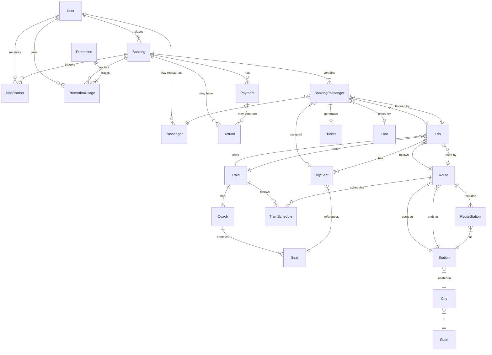

# Entity Relationship Diagram - Sudan Train Backend

## Complete Database Schema

This document provides a comprehensive view of the database schema after the ComprehensiveDatabaseImprovement migration.

## Entity Relationship Diagram



## Entity Categories

### 1. Identity & Security
- **User** - System users (passengers, admins)
- **Role** - User roles (via ASP.NET Identity)
- **UserRefreshToken** - JWT refresh tokens

### 2. Geography
- **State** - Sudan states
- **City** - Cities within states
- **Station** - Train stations

### 3. Train Infrastructure
- **Train** - Physical trains
- **Coach** - Train carriages/coaches
- **Seat** - Individual seats in coaches
- **Route** - Travel routes between stations
- **RouteStation** - Stations along a route
- **TrainSchedule** - Recurring train schedules

### 4. Operations
- **Trip** - Specific train journey
- **TripSeat** - Seat availability for a trip
- **Fare** - Pricing information

### 5. Transactions
- **Booking** - Customer reservations
- **BookingPassenger** - Junction between booking and passenger
- **Passenger** - Travel passenger details
- **Ticket** - Issued tickets
- **Payment** - Payment transactions
- **Refund** - Refund transactions

### 6. Business Features
- **Promotion** - Discount codes and campaigns
- **PromotionUsage** - Tracking of promotion usage
- **Notification** - System notifications

## Key Relationships Explained

### Booking Flow
```
User → Booking → BookingPassenger → Passenger
                → Payment
                → PromotionUsage → Promotion
                → Notification
```

### Seat Assignment
```
Train → Coach → Seat → TripSeat → BookingPassenger → Ticket
```

### Route Planning
```
State → City → Station → RouteStation → Route → Trip
                                              → TrainSchedule
```

## Audit Trail

### Entities with Full Audit Support
All entities inheriting from `AuditableEntity`:
- Train, Coach, Trip
- Route, Passenger
- Refund, Notification
- TrainSchedule, Promotion, PromotionUsage

**Audit Fields:**
- `CreatedAt` - When record was created
- `UpdatedAt` - When record was last modified
- `CreatedBy` - User ID who created the record
- `UpdatedBy` - User ID who last modified the record

### Entities with Soft Delete Support
None currently, but infrastructure is in place via `SoftDeletableEntity` base class.

## Security Features

### Encrypted Fields
- `User.Code` - Password reset codes
- `Passenger.IdNumber` - National ID/Passport numbers
- `Payment.CardToken` - Payment tokens
- `Payment.ProcessorResponse` - Sensitive payment data

**Encryption Provider**: AES-256
**Key**: Configured in ApplicationDBContext
**⚠️ Warning**: Never change the encryption key after data is encrypted!

## Performance Optimizations

### Unique Indexes (Fast Lookups)
- `Bookings.Reference`
- `Trains.TrainNumber`
- `Stations.Code`
- `Passengers.IdNumber`
- `Promotions.Code`
- `Refunds.RefundNumber`
- `TripSeats(TripId, SeatId)` - Composite unique

### Non-Unique Indexes (Filter & Join Performance)
- `Bookings.UserId`
- `Bookings.CreatedAt`
- `Bookings.Status`
- `BookingPassengers(BookingId, PassengerId)` - Composite
- `BookingPassengers.TripId`
- `TripSeats(TripId, Status)` - Composite
- `Notifications(UserId, IsRead)` - Composite
- `Notifications.Type`
- `PromotionUsages(PromotionId, UserId)` - Composite

## Computed Properties

### BookingPassenger.SeatNumber
```csharp
[NotMapped]
public string SeatNumber => TripSeat?.Seat?.SeatNumber ?? "N/A";
```

**Usage in Queries:**
```csharp
var passengers = await context.BookingPassengers
    .Include(bp => bp.TripSeat)
        .ThenInclude(ts => ts.Seat)
    .ToListAsync();

// Now passengers[0].SeatNumber will work
```

### TripSeat.Coach
```csharp
[NotMapped]
public Coach Coach => Seat.Coach;
```

**Usage in Queries:**
```csharp
var tripSeats = await context.TripSeats
    .Include(ts => ts.Seat)
        .ThenInclude(s => s.Coach)
    .ToListAsync();

// Now tripSeats[0].Coach will work
```

## Common Query Patterns

### Get User's Bookings with Full Details
```csharp
var bookings = await context.Bookings
    .Include(b => b.BookingPassengers)
        .ThenInclude(bp => bp.Passenger)
    .Include(b => b.BookingPassengers)
        .ThenInclude(bp => bp.TripSeat)
            .ThenInclude(ts => ts.Seat)
    .Include(b => b.Payments)
    .Include(b => b.PromotionUsages)
        .ThenInclude(pu => pu.Promotion)
    .Where(b => b.UserId == userId)
    .OrderByDescending(b => b.CreatedAt)
    .ToListAsync();
```

### Get Available Seats for a Trip
```csharp
var availableSeats = await context.TripSeats
    .Include(ts => ts.Seat)
        .ThenInclude(s => s.Coach)
    .Where(ts => ts.TripId == tripId && ts.Status == SeatStatus.Available)
    .OrderBy(ts => ts.Seat.Coach.Sequence)
    .ThenBy(ts => ts.Seat.SeatNumber)
    .ToListAsync();
```

### Get Active Promotions
```csharp
var now = DateTime.UtcNow;
var activePromotions = await context.Promotions
    .Where(p => p.IsActive 
             && p.ValidFrom <= now 
             && p.ValidTo >= now)
    .ToListAsync();
```

### Get User's Unread Notifications
```csharp
var notifications = await context.Notifications
    .Where(n => n.UserId == userId && !n.IsRead)
    .OrderByDescending(n => n.CreatedAt)
    .ToListAsync();
```

## Database Statistics

### Tables: 23
- Core: 13 original tables
- New: 5 new tables
- Identity: 7 ASP.NET Identity tables (security schema)

### Relationships: 35+
- One-to-Many: 28
- Many-to-One: 7
- One-to-One: 1 (BookingPassenger-Ticket)

### Indexes: 40+
- Unique: 7
- Non-Unique: 33+
- Composite: 10+

### Enum Types: 11
- BookingStatus, PaymentStatus, PaymentMethod
- SeatStatus, CoachClass
- RefundStatus, RefundMethod
- NotificationType, NotificationChannel
- RecurrenceType, PromotionType

## Next Steps

1. ✅ Apply migration to development environment
2. ✅ Run verification scripts
3. ✅ Test all critical workflows
4. ✅ Monitor performance
5. ⏳ Schedule production migration
6. ⏳ Update API documentation
7. ⏳ Update client applications for breaking changes
8. ⏳ Create seeder data for promotions
9. ⏳ Implement notification background job
10. ⏳ Implement refund workflow in business logic

## References

- [Migration Guide](./migration-guide.md) - Detailed migration instructions
- [Database Setup](./database-setup.md) - Initial setup guide
- [Pre-Migration Script](../../Sudan_Train.Infrastructure/Migrations/Scripts/PreMigration_DataBackup.sql)
- [Post-Migration Script](../../Sudan_Train.Infrastructure/Migrations/Scripts/PostMigration_Verification.sql)
- [Rollback Plan](../../Sudan_Train.Infrastructure/Migrations/Scripts/RollbackPlan.sql)
