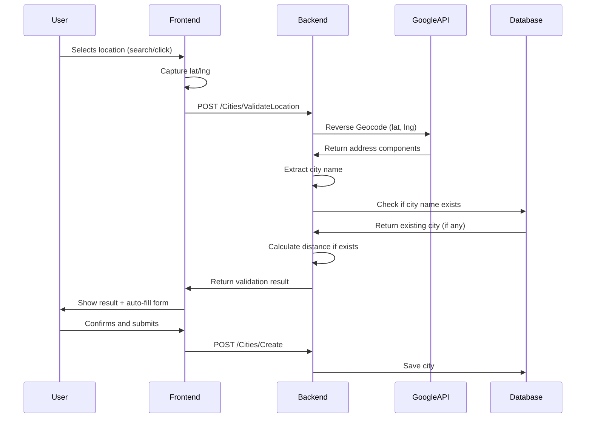

# City Duplicate Detection with Reverse Geocoding

## Problem Statement

Currently, users can add duplicate cities by clicking different points within the same city (e.g., clicking Khartoum center vs Khartoum east creates two separate entries). We need to use reverse geocoding to detect the actual city name from coordinates and prevent duplicates.

## Solution Architecture




## Backend Changes

### 1. Create ValidateCityLocation Endpoint

**File:** `apps/backend/Sudan_Train/Controllers/Infrastructure/Geography/CitiesController.cs`Add new endpoint that:

- Accepts latitude/longitude
- Calls Google Reverse Geocoding API
- Extracts city name from address components
- Checks database for existing city with that name
- If exists, calculates distance
- Returns validation result with suggested city data

**Response format:**

```json
{
  "isValid": false,
  "message": "City 'Khartoum' already exists 5.2km away",
  "existingCity": {
    "id": 1,
    "nameEn": "Khartoum",
    "nameAr": "الخرطوم",
    "latitude": 15.5007,
    "longitude": 32.5599
  },
  "suggestedData": {
    "nameEn": "Khartoum",
    "formattedAddress": "Khartoum, Sudan"
  }
}
```


### 2. Add Reverse Geocoding to GoogleGeocodingService

**File:** `apps/backend/Sudan_Train.Core/Services/Google/GoogleGeocodingService.cs`Add method:

```csharp
Task<ReverseGeocodeResult> ReverseGeocodeAsync(double latitude, double longitude)
```

This will call:

```javascript
https://maps.googleapis.com/maps/api/geocode/json?latlng={lat},{lng}&key={API_KEY}
```

Parse response and extract:

- City name (from `locality` or `administrative_area_level_2`)
- Formatted address
- Place ID

### 3. Update GeographyService

**File:** `apps/backend/Sudan_Train.Service/Implementations/GeographyService.cs`Add method:

```csharp
Task<CityValidationResult> ValidateCityLocationAsync(double latitude, double longitude)
```

Logic:

1. Call reverse geocoding
2. Extract city name
3. Search database for city with matching name (case-insensitive)
4. If found, calculate distance using Haversine formula
5. If distance < 50km, return duplicate error
6. If distance >= 50km, return warning (same name, different location)
7. If not found, return valid with suggested data

### 4. Create DTOs

**File:** `apps/backend/Sudan_Train.Data/DTOs/Infrastructure/CityValidationDto.cs` (new)

```csharp
public class CityValidationDto
{
    public bool IsValid { get; set; }
    public string Message { get; set; }
    public CityDto? ExistingCity { get; set; }
    public CityLocationSuggestion? SuggestedData { get; set; }
    public double? DistanceKm { get; set; }
}

public class CityLocationSuggestion
{
    public string NameEn { get; set; }
    public string FormattedAddress { get; set; }
    public string? GooglePlaceId { get; set; }
}
```


### 5. Update City Repository

**File:** `apps/backend/Sudan_Train.Infrastructure/Repositories/CityRepository.cs`Add method:

```csharp
Task<City?> GetByNameAsync(string nameEn)
```

Use case-insensitive search with EF Core:

```csharp
return await _context.Cities
    .FirstOrDefaultAsync(c => c.NameEn.ToLower() == nameEn.ToLower());
```


## Frontend Changes

### 6. Update CityModal Component

**File:** `apps/frontend/admin/src/components/geography/CityModal.tsx`Changes:

- When user selects location (search or map click), immediately call validation endpoint
- Show loading state during validation
- If duplicate detected, show error with distance info
- If valid, auto-fill form with suggested data
- Allow user to edit suggested names before submitting
- Add "Override" option for edge cases

Flow:

```typescript
const handleLocationSelect = async (lat: number, lng: number) => {
  setIsValidating(true);
  
  const validation = await citiesApi.validateLocation(lat, lng);
  
  if (!validation.isValid) {
    if (validation.existingCity) {
      setError(`City '${validation.existingCity.nameEn}' already exists ${validation.distanceKm}km away`);
      setCanSubmit(false);
    }
  } else {
    // Auto-fill form
    setFormData({
      ...formData,
      nameEn: validation.suggestedData.nameEn,
      formattedAddress: validation.suggestedData.formattedAddress,
      googlePlaceId: validation.suggestedData.googlePlaceId,
      latitude: lat,
      longitude: lng,
    });
    setCanSubmit(true);
  }
  
  setIsValidating(false);
};
```


### 7. Add Validation API Call

**File:** `apps/frontend/admin/src/services/api.ts`Add to citiesApi:

```typescript
validateLocation: (lat: number, lng: number) =>
  api.post<CityValidationResult>('/Infrastructure/Cities/ValidateLocation', {
    latitude: lat,
    longitude: lng
  }),
```


### 8. Update Types

**File:** `apps/frontend/admin/src/types/geography.ts`Add:

```typescript
export interface CityValidationResult {
  isValid: boolean;
  message: string;
  existingCity?: City;
  suggestedData?: {
    nameEn: string;
    formattedAddress: string;
    googlePlaceId?: string;
  };
  distanceKm?: number;
}
```


## Configuration

### 9. Ensure Google API Key is Set

**File:** `apps/backend/Sudan_Train/appsettings.json`Verify `GOOGLE_MAPS_API_KEY` environment variable is set or add to appsettings:

```json
{
  "GoogleMaps": {
    "ApiKey": "YOUR_API_KEY"
  }
}
```


## Testing Scenarios

1. **Same city, different points:**

- Add "Khartoum" at center (15.5007, 32.5599)
- Try to add at east (15.5200, 32.6000)
- Should be blocked with "City already exists 5km away"

2. **Different cities:**

- Add "Khartoum" at (15.5007, 32.5599)
- Add "Omdurman" at (15.6442, 32.4777)
- Should succeed (16km apart, different names)

3. **Manual map click:**

- Click anywhere in Khartoum
- Should auto-detect "Khartoum" via reverse geocoding
- Should block if already exists

4. **Search autocomplete:**

- Search "Khartoum"
- Should still validate via reverse geocoding
- Should detect duplicate

## Distance Threshold

Using **50km radius** as duplicate threshold because:

- Average city size in Sudan: 20-40km diameter
- Allows for city sprawl and suburbs
- Prevents false positives for nearby cities
- Can be adjusted via configuration

## Implementation Order

1. Backend: Add reverse geocoding to GoogleGeocodingService
2. Backend: Update GeographyService with validation logic
3. Backend: Create ValidateLocation endpoint in CitiesController
4. Backend: Add GetByNameAsync to CityRepository
5. Frontend: Update api.ts with validateLocation call